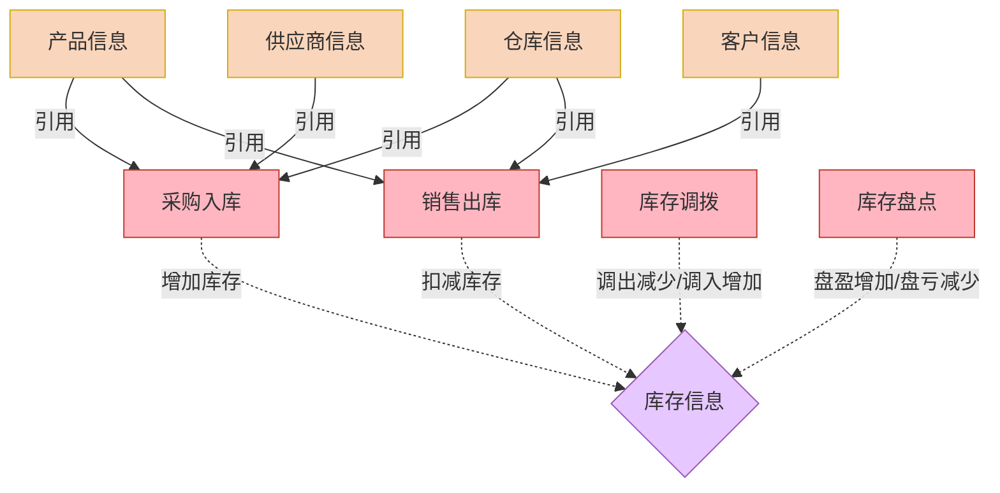

# 使用示例：进销存系统（含版本历史）

> 本文件由 SKILL.md 下沉而来，包含完整的四层输出示例与版本历史。
> 正文见 [../SKILL.md](../SKILL.md)。

---

## 示例 1：进销存系统

### 用户需求
"我要做一个进销存管理系统，包括采购入库、销售出库、库存管理，需要自动更新库存数量，库存不足时自动提醒。"

### 第一层输出：业务逻辑图


### 第二层输出：关键功能清单（部分）
```markdown
### 🔴 重难点功能清单

| 功能模块 | 涉及表单 | 功能描述 | 技术实现 | 难度 | 用户确认 |
|---------|---------|---------|---------|------|---------|
| 库存自动计算 | 库存信息 | 入库/出库后自动更新库存 | 业务关联规则（4 个） | 🔴 | ⬜ |
| 库存预警 | 库存信息 | 库存不足时自动提醒 | 集成自动化 + 钉钉消息 | 🔴 | ⬜ |
| 订单金额汇总 | 销售出库 | 子表金额自动求和 | 子表公式：SUM(金额) | 🟡 | ⬜ |

### 🟢 跨表单数据流清单

| 数据流向 | 源表单 | 目标表单 | 触发条件 | 操作 | 实现方式 |
|---------|-------|---------|---------|------|---------|
| 采购入库→库存 | 采购入库 | 库存信息 | 审核通过 | 增加 | 业务关联规则 |
| 销售出库→库存 | 销售出库 | 库存信息 | 审核通过 | 减少 | 业务关联规则 |
```

### 第三层输出：字段定义表（部分）
```markdown
### (一) 销售出库
**数据流向**：操作表  
**关联规则**：审核通过后扣减库存

| 字段名 | 类型 | 必填 | 校验 | 公式 | 数据源 | 组件 |
|-------|------|------|------|------|--------|------|
| 出库单号 | 文本 | 是 | - | "CK"+ 日期 + 流水号 | - | 单行文本 |
| 出库日期 | 日期 | 是 | - | - | - | 日期 |
| 客户名称 | 关联表单 | 是 | - | - | 客户信息 | 关联表单 |
| 出库总额 | 数字 | 是 | >0 | SUM(子表。金额) | - | 数字 |

#### 子表#出库明细#
| 字段名 | 类型 | 必填 | 校验 | 公式 | 数据源 | 组件 |
|-------|------|------|------|------|--------|------|
| 产品选择 | 关联表单 | 是 | - | - | 产品信息 | 关联表单 |
| 出库数量 | 数字 | 是 | <=库存，整数 | - | - | 数字 |
| 单价 | 数字 | 是 | >=0 | - | - | 数字 |
| 金额 | 数字 | 是 | - | 数量×单价 | - | 数字 |
```

### 第四层输出：自动化规则表（部分）
```markdown
### 业务关联规则

| 规则名称 | 触发表单 | 触发时机 | 目标表单 | 操作 | 过滤条件 |
|---------|---------|---------|---------|------|---------|
| 销售出库扣减库存 | 销售出库 | 审核通过后 | 库存信息 | 减少 | 产品 ID= 明细。产品 ID |

### 集成自动化

| 规则名称 | 触发类型 | 条件 | 动作 | 配置 |
|---------|---------|------|------|------|
| 库存预警通知 | 数据触发 | 库存<安全库存 | 钉钉消息 | 接收人：仓管员 |
```

---

## 版本历史

- v1.0.0 (2026/3/1): 初始版本，包含四层架构完整模板

**作者**：宜搭 AI 助手  
**最后更新**：2026/3/1
