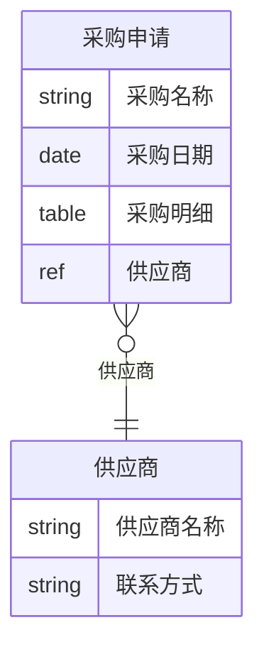

# ER 图格式与字段类型参考

> 本文档描述 er-diagram 候选 Skill 的输出格式、字段类型映射和 Schema 解析规则。

---

## 1. 输出格式

### 1.1 Mermaid ER 图（`.mmd`）

使用 Mermaid `erDiagram` 语法：



#### 关系符号说明

| 符号 | 含义 | 用途 |
|------|------|------|
| `}o--||` | 多对一（N:1） | 关联表单字段 |
| `||--o{` | 一对多（1:N） | 子表字段（子表挂在父表下） |

### 1.2 JSON 结构化数据（`.json`）

```json
{
  "metadata": {
    "generatedAt": "2026-07-10T12:00:00.000Z",
    "entityCount": 3,
    "relationCount": 2,
    "circularDependencyCount": 0,
    "isolatedFormCount": 1
  },
  "entities": [
    {
      "formUuid": "FORM-AAA",
      "name": "采购申请",
      "fieldCount": 4,
      "fields": [
        { "fieldId": "textField_xxx", "label": "采购名称", "type": "textField", "isSubTable": false, "associatesTo": null },
        { "fieldId": "tableField_xxx", "label": "采购明细", "type": "tableField", "isSubTable": true, "associatesTo": null },
        { "fieldId": "associationFormField_xxx", "label": "供应商", "type": "associationFormField", "isSubTable": false, "associatesTo": "FORM-BBB" }
      ]
    }
  ],
  "relations": [
    {
      "from": "FORM-AAA",
      "fromName": "采购申请",
      "to": "FORM-BBB",
      "toName": "供应商",
      "type": "association",
      "direction": "N:1",
      "viaField": "供应商",
      "fieldId": "associationFormField_xxx"
    }
  ],
  "circularDependencies": [],
  "isolatedForms": []
}
```

### 1.3 Markdown 分析报告（`.md`）

包含以下章节：
- **概览**：实体数、关系数、循环依赖数、孤立表单数
- **实体清单**：所有表单的名称、UUID、字段数
- **关系清单**：所有关系的来源、方向、目标、类型、经由字段
- **循环依赖检测**：如有，列出循环路径
- **孤立表单检测**：如有，列出孤立表单
- **ER 关系图**：Mermaid 图

---

## 2. 字段类型映射

### 2.1 Schema 字段类型 → Mermaid 类型

| 宜搭字段类型 | Mermaid 类型 | 说明 |
|-------------|-------------|------|
| `textField` | `string` | 文本 |
| `textareaField` | `string` | 多行文本 |
| `numberField` | `int` | 数字 |
| `moneyField` | `int` | 金额 |
| `dateField` | `datetime` | 日期 |
| `dateTimeField` | `datetime` | 日期时间 |
| `selectField` | `enum` | 下拉选择 |
| `radioField` | `enum` | 单选 |
| `checkboxField` | `enum` | 多选 |
| `multiselectField` | `enum` | 多选 |
| `tableField` | `table` | 子表（明细） |
| `subFormField` | `table` | 子表单 |
| `associationFormField` | `ref` | 关联表单 |
| `relateField` | `ref` | 关联表单（旧） |
| `attachmentField` | `blob` | 附件 |
| `employeeField` | `ref` | 人员 |
| `departmentField` | `ref` | 部门 |
| `addressField` | `string` | 地址 |
| `richTextField` | `string` | 富文本 |
| 其他 | `string` | 默认 |

### 2.2 关系类型识别规则

| 关系类型 | Schema 判定条件 | ER 方向 |
|---------|----------------|---------|
| 子表（1:N） | 字段 `type` / `fieldType` 包含 `tableField` 或 `subFormField` | 父表 1:N 子表 |
| 关联表单（N:1） | 字段 `type` / `fieldType` 包含 `associationFormField` 或 `relateField` | 当前表 N:1 被关联表 |

### 2.3 关联表单 UUID 提取

从关联表单字段中提取被关联表单的 UUID，按以下优先级尝试：

1. `field.props.formUuid`
2. `field.props.associateFormUuid`
3. `field.props.formUuids[0]`（数组形式）
4. `field.formUuid`
5. `field.associateFormUuid`
6. `field.relateFormUuid`
7. `field.config.formUuid`

---

## 3. Schema 解析兼容性

### 3.1 支持的 Schema 结构

er-diagram 兼容以下 Schema 结构：

#### 结构 A：直接字段列表

```json
{
  "formUuid": "FORM-xxx",
  "name": "表单名称",
  "fields": [...]
}
```

#### 结构 B：fieldList 形式

```json
{
  "formUuid": "FORM-xxx",
  "name": "表单名称",
  "fieldList": [...]
}
```

#### 结构 C：V5 Schema（pages > componentsTree）

```json
{
  "pages": [{
    "componentsTree": [...],
    "fieldList": [...]
  }]
}
```

#### 结构 D：API 响应（content 包装）

```json
{
  "success": true,
  "content": {
    "formUuid": "FORM-xxx",
    "name": "表单名称",
    "fields": [...]
  }
}
```

### 3.2 字段提取规则

1. 优先从 `fields` 数组提取
2. 其次从 `fieldList` 数组提取
3. 再次从 `children` 数组提取
4. 最后从 `pages[].componentsTree` 递归展平提取
5. 如果 Schema 被 `content` 包装，自动展开

---

## 4. 循环依赖检测算法

使用 DFS（深度优先搜索）遍历关联关系图，检测是否存在环形路径。

例如：A → B → C → A 是一个循环依赖。

检测到循环依赖时：
- 在报告中标注循环路径
- 不阻断 ER 图生成（循环依赖是警告，不是错误）

---

## 5. 孤立表单检测规则

孤立表单 = 没有被任何其他表单通过关联表单字段引用的表单。

注意：
- 孤立表单不一定是废表——它可能是主数据表（如基础数据表）
- 子表不算独立实体（子表是父表的一部分）
- 检测结果仅供参考，需人工确认

---

*创建日期：2026-07-10 (Phase 5-0)*
