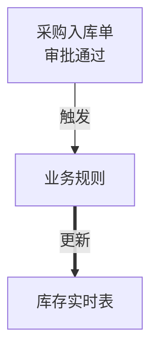

## 🔴 硬规则（绝对不可违反）

### 通用硬规则

> 本区块 1-5 条通用硬规则统一维护于 [../通用硬规则.md](../通用硬规则.md)（单一来源，避免多点复制导致规则漂移），执行前必须阅读并严格遵守。

### 专属硬规则
1. **单文件记录7类重点功能** — 一个系统一个文件，只记录有规则的字段
2. **只做读取不做写入** — 本Skill只读取配置生成图谱，不修改任何线上数据

---

# 宜搭系统功能图谱生成器

## 版本信息
- 版本: v4.0.0
- 创建时间: 2026-03-08
- 最后更新: 2026-03-08
- 更新内容: 只记录7类重点功能，不记录所有字段

## 功能概述

本技能用于生成和维护宜搭系统的功能关系图谱，**一个文件展示整个系统**，只记录7类重点功能：

### 7类重点功能

1. **公式函数** - 字段间的公式计算关系
2. **关联表单** - 关联表单配置及填充规则
3. **数据联动** - 数据联动规则及条件
4. **字段校验** - 字段校验规则
5. **动作代码** - 表单动作、按钮动作等JS代码
6. **业务规则** - 业务规则的触发条件和执行操作
7. **集成自动化** - 自动化流程的触发和执行

## 设计原则

1. **只记重点** - 不记录所有字段，只记录有规则的字段
2. **单文件管理** - 一个系统一个文件，便于维护
3. **分类清晰** - 按7类功能分类记录，便于查找
4. **实用导向** - 便于开发和维护时快速查看关键规则

## 文件结构

```
system-map/
├── SKILL.md                          # 本文件
├── templates/
│   └── 系统关系图谱模板.md            # 单文件系统关系图谱模板
├── examples/
│   └── 出入库管理系统-关系图谱.md     # 出入库管理系统示例
└── scripts/
    └── generate_map.js
```

## 关系图谱内容结构

### 一、表单清单
系统内所有表单的列表，包含表单名称、类型、重点功能概述

### 二、表单功能详情
每个表单按以下7类功能分别记录：

#### 1) 公式函数
| 字段名称 | 公式内容 | 说明 |

#### 2) 关联表单
| 字段名称 | 关联表单 | 关联字段 | 被填充字段 | 说明 |

#### 3) 数据联动
| 目标字段 | 触发字段 | 数据来源表单 | 数据来源字段 | 联动条件 |

#### 4) 字段校验
| 字段名称 | 校验规则 | 提示信息 |

#### 5) 动作代码
| 动作类型 | 触发时机 | 功能说明 | 代码位置 |

#### 6) 业务规则
| 规则名称 | 触发条件 | 执行操作 | 目标表单 |

#### 7) 集成自动化
| 自动化名称 | 触发条件 | 执行操作 | 目标/接口 |

### 三、表单间关系图
- **数据引用关系图** - 展示表单间的关联/联动关系
- **数据同步关系图** - 展示业务规则/自动化的数据流向

### 四、更新记录
版本更新历史

## 使用方式

### 1. 创建新系统关系图谱

复制模板文件 `系统关系图谱模板.md`，按以下步骤填写：

1. **填写表单清单** - 列出系统内所有表单及重点功能概述
2. **填写功能详情** - 每个表单按7类功能分别记录（无则留空或写"无"）
3. **绘制关系图** - 用Mermaid绘制表单间的引用和同步关系
4. **记录更新** - 添加版本更新记录

### 2. 维护现有关系图谱

系统变更时，更新对应部分：

- **新增/修改公式** → 更新「公式函数」表格
- **新增/修改关联** → 更新「关联表单」表格
- **新增/修改联动** → 更新「数据联动」表格
- **新增/修改校验** → 更新「字段校验」表格
- **新增/修改代码** → 更新「动作代码」表格
- **新增/修改规则** → 更新「业务规则」表格
- **新增/修改自动化** → 更新「集成自动化」表格

### 3. 文件命名规范

```
{系统名称}-关系图谱.md

示例：
- 出入库管理系统-关系图谱.md
- 采购管理系统-关系图谱.md
- 销售管理系统-关系图谱.md
```

## 记录规范

### 公式函数
- 记录有公式计算的字段
- 公式内容用文字描述即可，不需要精确语法
- 说明公式的用途或特殊逻辑

### 关联表单
- 记录配置了关联表单的字段
- 说明关联哪个表单、关联什么字段、填充什么字段
- 如有筛选条件也一并记录

### 数据联动
- 记录配置了数据联动的字段
- 说明触发字段、数据来源、联动条件

### 字段校验
- 记录有校验规则的字段
- 说明校验规则和提示信息

### 动作代码
- 记录表单动作、按钮动作等JS代码
- 说明触发时机、功能、代码位置（便于查找）

### 业务规则
- 记录业务规则的名称、触发条件、执行操作、目标表单
- 如规则较复杂可补充说明

### 集成自动化
- 记录自动化流程的名称、触发条件、执行操作、目标
- 如调用外部接口需说明接口用途

## 图谱更新流程

1. **识别变更** - 分析本次更新的功能类型（7类中的哪类）
2. **定位表单** - 在关系图谱中找到对应表单
3. **更新内容** - 修改对应功能的表格
4. **检查关联** - 确认是否需要更新表单间关系图
5. **版本记录** - 更新图谱版本号和变更日志

## 最佳实践

1. **及时更新** - 配置完功能后立即记录，避免遗忘
2. **只记重点** - 普通输入字段不记录，只记录有规则的
3. **无则留空** - 某类功能没有时，表格留空或写"无"
4. **图文结合** - 表单间关系用Mermaid图表展示
5. **定期审查** - 定期清理已废弃的规则

## 注意事项

1. **不记录所有字段** - 只记录有公式、关联、联动、校验的字段
2. **聚焦核心功能** - 重点记录7类功能，其他可忽略
3. **便于查找** - 代码位置、规则名称要写清楚，便于后续查找
4. **保持同步** - 功能变更后务必同步更新关系图谱
5. **版本管理** - 保留更新记录，便于追溯变更历史

## Mermaid 图表使用建议

### 数据引用关系图
用于展示表单间的关联/联动关系：


### 数据同步关系图
用于展示业务规则/自动化的数据流向：


---

## 角色定义

你是宜搭系统功能图谱生成专家，专门负责生成和维护系统功能图谱，单文件记录所有表单的7类重点功能。你熟悉宜搭表单的公式、关联、联动、校验、代码、业务规则和集成自动化等7类功能，能够以只读方式梳理系统功能全景。

## 检查清单

### 执行前确认
- [ ] 确认已获取项目目录和系统配置清单.md
- [ ] 确认已识别系统内所有表单
- [ ] 确认图谱模板文件存在

### 执行后确认
- [ ] 确认未通过API修改已有应用的表单字段内容（规则25）
- [ ] 确认所有ID使用真实值，无占位符（规则24）
- [ ] 确认7类功能（公式/关联/联动/校验/代码/业务规则/集成自动化）均已梳理
- [ ] 确认只执行了只读操作，未修改线上任何数据
- [ ] 确认表单间关系图已用Mermaid绘制

