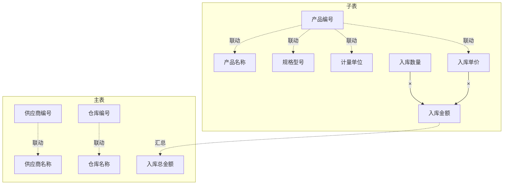
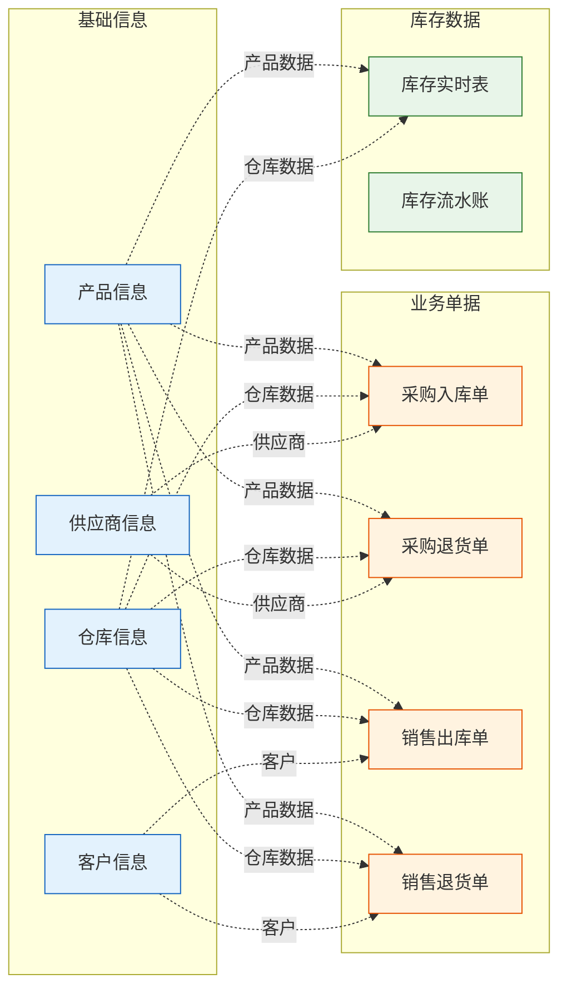
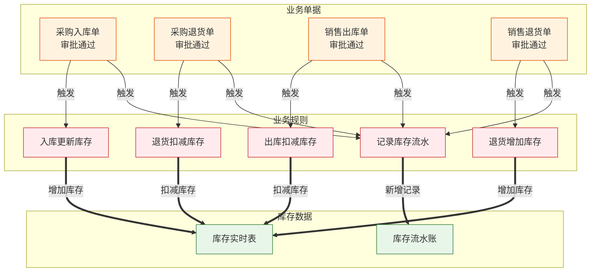

***

# 出入库管理系统关系图谱

# 版本: v1.0.0

# 用途: 单文件记录系统内所有表单的字段规则和表单关联

***

# 出入库管理系统关系图谱

## 一、表单清单

| 序号 | 表单名称  | 表单类型 | 说明       |
| -- | ----- | ---- | -------- |
| 1  | 产品信息  | 普通表单 | 维护产品基础资料 |
| 2  | 仓库信息  | 普通表单 | 维护仓库基础资料 |
| 3  | 供应商信息 | 普通表单 | 维护供应商资料  |
| 4  | 客户信息  | 普通表单 | 维护客户资料   |
| 5  | 采购入库单 | 流程表单 | 采购入库业务单据 |
| 6  | 采购退货单 | 流程表单 | 采购退货业务单据 |
| 7  | 销售出库单 | 流程表单 | 销售出库业务单据 |
| 8  | 销售退货单 | 流程表单 | 销售退货业务单据 |
| 9  | 库存实时表 | 普通表单 | 实时库存数据汇总 |
| 10 | 库存流水账 | 普通表单 | 库存变动明细记录 |

***

## 二、表单内字段规则

### 2.1 产品信息

#### 字段规则表

| 字段名称 | 规则说明      |
| ---- | --------- |
| 产品编号 | 输入字段，唯一编码 |
| 产品名称 | 输入字段      |
| 规格型号 | 输入字段      |
| 计量单位 | 输入字段      |
| 参考单价 | 输入字段      |
| 产品类别 | 输入字段      |

***

### 2.2 仓库信息

#### 字段规则表

| 字段名称 | 规则说明      |
| ---- | --------- |
| 仓库编号 | 输入字段，唯一编码 |
| 仓库名称 | 输入字段      |
| 仓库地址 | 输入字段      |
| 负责人  | 输入字段      |

***

### 2.3 采购入库单

#### 字段规则表

| 字段名称  | 规则说明                            |
| ----- | ------------------------------- |
| 入库单号  | 系统自动生成                          |
| 入库日期  | 默认当前日期                          |
| 供应商编号 | 关联：供应商信息.供应商编号                  |
| 供应商名称 | 联动：供应商信息.供应商名称                  |
| 仓库编号  | 关联：仓库信息.仓库编号                    |
| 仓库名称  | 联动：仓库信息.仓库名称                    |
| 入库总金额 | 公式：SUMPRODUCT(子表.入库数量, 子表.入库单价) |
| 经办人   | 当前登录用户                          |

**子表字段（入库明细）：**

| 字段名称 | 规则说明              |
| ---- | ----------------- |
| 产品编号 | 关联：产品信息.产品编号      |
| 产品名称 | 联动：产品信息.产品名称      |
| 规格型号 | 联动：产品信息.规格型号      |
| 计量单位 | 联动：产品信息.计量单位      |
| 入库单价 | 联动：产品信息.参考单价（可修改） |
| 入库数量 | 输入字段              |
| 入库金额 | 公式：入库数量 × 入库单价    |
| 批次号  | 输入字段              |

#### 字段依赖图

***

### 2.4 销售出库单

#### 字段规则表

| 字段名称  | 规则说明                            |
| ----- | ------------------------------- |
| 出库单号  | 系统自动生成                          |
| 出库日期  | 默认当前日期                          |
| 客户编号  | 关联：客户信息.客户编号                    |
| 客户名称  | 联动：客户信息.客户名称                    |
| 仓库编号  | 关联：仓库信息.仓库编号                    |
| 仓库名称  | 联动：仓库信息.仓库名称                    |
| 出库总金额 | 公式：SUMPRODUCT(子表.出库数量, 子表.出库单价) |

**子表字段（出库明细）：**

| 字段名称 | 规则说明                 |
| ---- | -------------------- |
| 产品编号 | 关联：产品信息.产品编号         |
| 产品名称 | 联动：产品信息.产品名称         |
| 规格型号 | 联动：产品信息.规格型号         |
| 出库单价 | 公式：库存实时表.平均成本（取当前成本） |
| 出库数量 | 输入字段                 |
| 出库金额 | 公式：出库数量 × 出库单价       |

***

### 2.5 库存实时表

#### 字段规则表

| 字段名称   | 规则说明               |
| ------ | ------------------ |
| 产品编号   | 关联：产品信息.产品编号       |
| 仓库编号   | 关联：仓库信息.仓库编号       |
| 当前库存   | 公式：入库数量合计 - 出库数量合计 |
| 可用库存   | 公式：当前库存 - 锁定库存     |
| 锁定库存   | 输入字段               |
| 平均成本   | 公式：入库金额合计 ÷ 入库数量合计 |
| 最后更新时间 | 系统字段               |

***

## 三、表单间关联关系

### 3.1 数据引用关系图

### 3.2 数据反向同步关系图

***

## 四、表单关系汇总

### 4.1 产品信息

**被其他表单引用：**

- 采购入库单 ← 产品编号/名称/规格/单位（方式：关联+联动）
- 采购退货单 ← 产品编号/名称/规格/单位（方式：关联+联动）
- 销售出库单 ← 产品编号/名称/规格/单位（方式：关联+联动）
- 销售退货单 ← 产品编号/名称/规格/单位（方式：关联+联动）
- 库存实时表 ← 产品编号（方式：关联）

***

### 4.2 仓库信息

**被其他表单引用：**

- 采购入库单 ← 仓库编号/名称（方式：关联+联动）
- 采购退货单 ← 仓库编号/名称（方式：关联+联动）
- 销售出库单 ← 仓库编号/名称（方式：关联+联动）
- 销售退货单 ← 仓库编号/名称（方式：关联+联动）
- 库存实时表 ← 仓库编号（方式：关联）

***

### 4.3 供应商信息

**被其他表单引用：**

- 采购入库单 ← 供应商编号/名称（方式：关联+联动）
- 采购退货单 ← 供应商编号/名称（方式：关联+联动）

***

### 4.4 客户信息

**被其他表单引用：**

- 销售出库单 ← 客户编号/名称（方式：关联+联动）
- 销售退货单 ← 客户编号/名称（方式：关联+联动）

***

### 4.5 采购入库单

**引用其他表单：**

- 产品信息 → 产品编号/名称/规格/单位/参考单价（方式：关联+联动）
- 仓库信息 → 仓库编号/名称（方式：关联+联动）
- 供应商信息 → 供应商编号/名称（方式：关联+联动）

**被其他表单引用/同步：**

- 库存实时表 ← 入库数量（方式：业务规则，触发：审批通过，操作：增加库存）
- 库存流水账 ← 入库明细（方式：业务规则，触发：审批通过，操作：新增记录）

***

### 4.6 销售出库单

**引用其他表单：**

- 产品信息 → 产品编号/名称/规格/单位（方式：关联+联动）
- 仓库信息 → 仓库编号/名称（方式：关联+联动）
- 客户信息 → 客户编号/名称（方式：关联+联动）
- 库存实时表 → 平均成本（方式：公式引用）

**被其他表单引用/同步：**

- 库存实时表 ← 出库数量（方式：业务规则，触发：审批通过，操作：扣减库存）
- 库存流水账 ← 出库明细（方式：业务规则，触发：审批通过，操作：新增记录）

***

### 4.7 库存实时表

**引用其他表单：**

- 产品信息 → 产品编号（方式：关联）
- 仓库信息 → 仓库编号（方式：关联）

**被其他表单引用/同步：**

- 销售出库单 ← 平均成本（方式：公式引用）
- 库存流水账 ← 库存变动（方式：业务规则触发）

**数据流入（业务规则更新）：**

- 采购入库单 → 入库数量（触发：审批通过，操作：增加库存）
- 采购退货单 → 退货数量（触发：审批通过，操作：扣减库存）
- 销售出库单 → 出库数量（触发：审批通过，操作：扣减库存）
- 销售退货单 → 退货数量（触发：审批通过，操作：增加库存）

***

### 4.8 库存流水账

**引用其他表单：**

- 产品信息 → 产品编号（方式：关联）
- 仓库信息 → 仓库编号（方式：关联）

**数据流入（业务规则新增）：**

- 采购入库单 → 入库明细（触发：审批通过，操作：新增流水记录）
- 采购退货单 → 退货明细（触发：审批通过，操作：新增流水记录）
- 销售出库单 → 出库明细（触发：审批通过，操作：新增流水记录）
- 销售退货单 → 退货明细（触发：审批通过，操作：新增流水记录）

***

## 五、更新记录

| 版本   | 时间         | 更新内容               |
| ---- | ---------- | ------------------ |
| v1.0 | 2026-03-08 | 初始版本，建立出入库管理系统关系图谱 |

