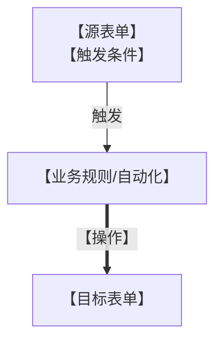

---
# 【系统名称】关系图谱
# 版本: v4.0.0
# 用途: 单文件记录系统内所有表单的重点功能规则
# 更新说明: 只记录7类重点功能，不记录所有字段
---

# 【系统名称】关系图谱

## 一、表单清单

| 序号 | 表单名称 | 表单类型 | 重点功能概述 |
|-----|---------|---------|-------------|
| 1 | 【表单1】 | 【类型】 | 【概述】 |
| 2 | 【表单2】 | 【类型】 | 【概述】 |

---

## 二、表单功能详情

### 2.1 【表单1名称】

#### 1) 公式函数

| 字段名称 | 公式内容 | 说明 |
|---------|---------|------|
| 【字段】 | 【公式】 | 【说明】 |

#### 2) 关联表单

| 字段名称 | 关联表单 | 关联字段 | 被填充字段 | 说明 |
|---------|---------|---------|----------|------|
| 【字段】 | 【表单】 | 【字段】 | 【字段】 | 【说明】 |

#### 3) 数据联动

| 目标字段 | 触发字段 | 数据来源表单 | 数据来源字段 | 联动条件 |
|---------|---------|-------------|-------------|---------|
| 【字段】 | 【字段】 | 【表单】 | 【字段】 | 【条件】 |

#### 4) 字段校验

| 字段名称 | 校验规则 | 提示信息 |
|---------|---------|---------|
| 【字段】 | 【规则】 | 【提示】 |

#### 5) 动作代码

| 动作类型 | 触发时机 | 功能说明 | 代码位置 |
|---------|---------|---------|---------|
| 【动作】 | 【时机】 | 【功能】 | 【文件/位置】 |

#### 6) 业务规则

| 规则名称 | 触发条件 | 执行操作 | 目标表单 |
|---------|---------|---------|---------|
| 【规则】 | 【条件】 | 【操作】 | 【表单】 |

#### 7) 集成自动化

| 自动化名称 | 触发条件 | 执行操作 | 目标/接口 |
|-----------|---------|---------|----------|
| 【自动化】 | 【条件】 | 【操作】 | 【目标】 |

---

### 2.2 【表单2名称】

#### 1) 公式函数

| 字段名称 | 公式内容 | 说明 |
|---------|---------|------|
| 【字段】 | 【公式】 | 【说明】 |

#### 2) 关联表单

| 字段名称 | 关联表单 | 关联字段 | 被填充字段 | 说明 |
|---------|---------|---------|----------|------|
| 【字段】 | 【表单】 | 【字段】 | 【字段】 | 【说明】 |

#### 3) 数据联动

| 目标字段 | 触发字段 | 数据来源表单 | 数据来源字段 | 联动条件 |
|---------|---------|-------------|-------------|---------|
| 【字段】 | 【字段】 | 【表单】 | 【字段】 | 【条件】 |

#### 4) 字段校验

| 字段名称 | 校验规则 | 提示信息 |
|---------|---------|---------|
| 【字段】 | 【规则】 | 【提示】 |

#### 5) 动作代码

| 动作类型 | 触发时机 | 功能说明 | 代码位置 |
|---------|---------|---------|---------|
| 【动作】 | 【时机】 | 【功能】 | 【文件/位置】 |

#### 6) 业务规则

| 规则名称 | 触发条件 | 执行操作 | 目标表单 |
|---------|---------|---------|---------|
| 【规则】 | 【条件】 | 【操作】 | 【表单】 |

#### 7) 集成自动化

| 自动化名称 | 触发条件 | 执行操作 | 目标/接口 |
|-----------|---------|---------|----------|
| 【自动化】 | 【条件】 | 【操作】 | 【目标】 |

---

## 三、表单间关系图

### 3.1 数据引用关系

### 3.2 数据同步关系

---

## 四、更新记录

| 版本 | 时间 | 更新内容 |
|------|------|---------|
| v1.0 | 【日期】 | 初始版本 |

