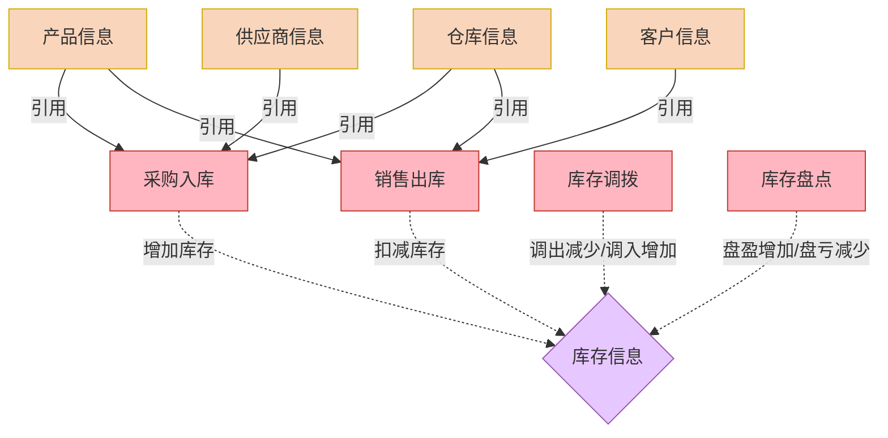

## 🔴 硬规则（绝对不可违反）

### 通用硬规则
1. **禁止通过API修改已有应用的表单字段内容** — 公式、代码、字段增删改只能复制粘贴（规则25）
2. **应用ID和表单UUID必须填真实值** — 从系统配置清单.md读取，严禁占位符（规则24）
3. **写入文件前必须校验** — 运行 `node scripts/ai-validator.js check-before-write <文件路径>` 确认不覆盖已有文件
4. **写入文件后必须校验** — 运行 `node scripts/ai-validator.js check-after-write <文件路径>` 确认内容合规
5. **Cookie必须使用根目录** — 严禁 process.cwd()，必须用 PROJECT_ROOT（规则26）

### 专属硬规则
1. **四层架构输出** — 业务逻辑图→关键功能清单→字段定义表→自动化逻辑规则
2. **分阶段问答式访谈** — 逐步引导用户明确需求，不一次性输出全部

---

# yida-architect 技能

> 版本：v1.5.0
> 创建日期：2026/3/1  
> 适用宜搭版本：3.0+  
> 作者：宜搭 AI 助手

---

## 📋 技能定位

**专为宜搭低代码平台设计的系统架构师技能**。能够将模糊的业务需求转化为标准的"数据模型图"、"关键功能清单"、"字段定义表"和"自动化逻辑规则"，直接指导开发人员配置宜搭表单、流程和集成自动化。

### 如何使用本技能（分阶段问答式需求梳理）

本技能采用**分阶段问答式访谈机制**来帮助您梳理需求。整个过程分为 **4 个阶段**，每阶段聚焦一个核心目标，阶段之间需要**用户确认**后再进入下一阶段。

> 📖 **详细使用说明**：请参考根目录下的《用户使用说明书.md》

#### 分阶段访谈流程

```
┌─────────────────────────────────────────────────────────────┐
│  第一阶段：业务逻辑梳理（约 10-15 分钟）                      │
│  ├── 了解业务场景（行业、痛点）                              │
│  ├── 梳理表单结构（基础表、业务表）                          │
│  └── 确认数据流向（业务流程）                                │
│                          ↓                                   │
│  【生成】第一层：业务逻辑图（Mermaid）                        │
│  【确认】用户确认业务逻辑无误后，进入第二阶段                 │
└─────────────────────────────────────────────────────────────┘
                              ↓
┌─────────────────────────────────────────────────────────────┐
│  第二阶段：功能需求细化（约 10-15 分钟）                      │
│  ├── 明确计算需求（自动更新、统计汇总）                      │
│  ├── 确定审批流程（哪些环节需要审批）                        │
│  └── 梳理通知提醒（跟进提醒、进度提醒）                      │
│                          ↓                                   │
│  【生成】第二层：关键功能清单（4个表格）                      │
│  【确认】用户确认功能清单后，进入第三阶段                     │
└─────────────────────────────────────────────────────────────┘
                              ↓
┌─────────────────────────────────────────────────────────────┐
│  第三阶段：字段详细定义（约 15-20 分钟）                      │
│  ├── 逐个表单梳理字段                                        │
│  ├── 确定字段类型和校验规则                                  │
│  └── 配置公式和联动                                          │
│                          ↓                                   │
│  【生成】第三层：字段定义表                                   │
│  【确认】用户确认字段定义后，进入第四阶段                     │
└─────────────────────────────────────────────────────────────┘
                              ↓
┌─────────────────────────────────────────────────────────────┐
│  第四阶段：自动化规则配置（约 10-15 分钟）                    │
│  ├── 业务关联规则（自动更新其他表单）                        │
│  ├── 集成自动化（定时提醒、通知）                            │
│  └── 审批流程配置（审批节点、条件）                          │
│                          ↓                                   │
│  【生成】第四层：自动化规则表                                 │
│  【确认】用户确认自动化规则后，生成完整需求文档               │
└─────────────────────────────────────────────────────────────┘
```

**总耗时**：约 45-65 分钟（可分多次完成）

#### 分阶段的优势

1. **逻辑清晰**：先梳理框架，再细化功能，避免前后矛盾
2. **用户友好**：每阶段有明确交付物，用户可以看到进展
3. **灵活调整**：任何阶段都可以返回修改，不会影响后续
4. **节省时间**：如果业务逻辑不清晰，不会进入无意义的细节讨论

#### 您只需要这样做：
1. **告诉我您的业务场景**（我会自动进入第一阶段）
2. **分阶段回答问题**（每阶段结束后会生成文档供您确认）
3. **确认每阶段文档**（确认无误后进入下一阶段）
4. **获得完整需求文档**（四层架构文档，可直接用于开发）

#### 注意事项

- **宜搭天然支持多端**：电脑、手机、平板均可使用，无需询问移动端需求
- **可分多次完成**：如果时间较长，可以说"今天先到这里"，下次继续
- **随时可修改**：任何阶段都可以返回上一阶段修改
- **有使用说明书**：详细说明请参考《用户使用说明书.md》

---

### 核心能力
- ✅ 深入理解宜搭平台特性（表单设计器、业务关联规则、集成自动化、流程设计器）
- ✅ 掌握宜搭数据模型设计最佳实践（主表 - 子表结构、关联表单、数据联动）
- ✅ 熟悉宜搭公式引擎和计算逻辑（跨表汇总、条件计算、子表聚合）
- ✅ 精通宜搭自动化配置（业务关联规则、集成自动化、定时任务、Webhook）
- ✅ 了解宜搭权限体系（数据权限、字段权限、角色权限）

---

## 🛠️ 脚本工具说明

本技能包含以下脚本工具，位于 `scripts/` 目录：

### 1. `generate_logic_diagram.js` - 业务逻辑图生成器
**功能**：根据表单关系数据生成 Mermaid 格式的业务逻辑图

```javascript
const { generateLogicDiagram } = require('./scripts/generate_logic_diagram');

const config = {
    basicForms: [{ name: '客户信息' }, { name: '产品信息' }],
    inventoryForms: [{ name: '库存信息', type: 'central' }],
    operationForms: [{ name: '采购入库' }, { name: '销售出库' }],
    relations: [
        { from: 'A', to: 'C', type: 'reference', label: '引用' },
        { from: 'C', to: 'D', type: 'push', label: '增加库存' }
    ]
};

const mermaidCode = generateLogicDiagram(config);
```

### 2. `generate_feature_list.js` - 关键功能清单生成器
**功能**：生成标准化的关键功能清单表格

```javascript
const { generateFeatureList } = require('./scripts/generate_feature_list');

const config = {
    difficultyFeatures: [...],  // 重难点功能
    subTables: [...],           // 子表结构
    dataFlows: [...],           // 跨表单数据流
    specialFeatures: [...]      // 特殊功能需求
};

const featureList = generateFeatureList(config);
```

### 3. `generate_automation_rules.js` - 自动化规则表生成器
**功能**：生成标准化的自动化规则配置表

```javascript
const { generateAutomationRules } = require('./scripts/generate_automation_rules');

const config = {
    businessRules: [...],           // 业务关联规则
    integrationAutomations: [...],  // 集成自动化
    approvalProcesses: [...],       // 审批流程
    formulaRules: [...]             // 公式计算规则
};

const automationRules = generateAutomationRules(config);
```

### 4. `utils.js` - 工具函数集合
**功能**：提供通用的工具函数和常量定义

```javascript
const {
    FORM_CATEGORIES,           // 表单分类常量
    YIDA_FIELD_TYPES,          // 宜搭字段类型映射
    BUSINESS_RULE_OPERATIONS,  // 业务关联规则操作类型
    TRIGGER_TIMINGS,           // 触发时机常量
    DIFFICULTY_LEVELS,         // 开发难度等级
    generateId,                // 生成唯一ID
    validateFormName,          // 验证表单名称
    validateFieldName,         // 验证字段名称
    recommendFormStructure,    // 推荐表单结构
    generateFormula,           // 生成公式表达式
    formatDate,                // 格式化日期
    generateVersion            // 生成版本号
} = require('./scripts/utils');
```

### 5. `requirement_interview.js` - 需求访谈问卷（分阶段版）
**功能**：通过分阶段问答机制帮助用户梳理业务需求

```javascript
const { 
    INTERVIEW_STAGES,        // 四个阶段定义
    STAGE_1_QUESTIONS,       // 第一阶段问题（业务逻辑）
    STAGE_2_QUESTIONS,       // 第二阶段问题（功能需求）
    STAGE_3_TEMPLATE,        // 第三阶段模板（字段定义）
    STAGE_4_QUESTIONS,       // 第四阶段问题（自动化规则）
    getBusinessRecommendations,  // 根据业务类型推荐
    generateStageIntro,      // 生成阶段引导语
    generateStageSummary     // 生成阶段总结
} = require('./scripts/requirement_interview');

// 获取阶段引导语
const stage1Intro = generateStageIntro('STAGE_1');

// 获取业务推荐
const recommendations = getBusinessRecommendations('装修');

// 生成阶段总结
const summary = generateStageSummary('STAGE_1', answers);
```

**分阶段说明**：
- **STAGE_1**：业务逻辑梳理（业务场景、表单结构、数据流向）
- **STAGE_2**：功能需求细化（计算、审批、通知、报表）
- **STAGE_3**：字段详细定义（逐个表单梳理字段）
- **STAGE_4**：自动化规则配置（业务规则、审批流程、提醒）

---

## 🎯 核心输出物（四层架构）

**输出位置**：`03项目交付物/{项目名称}/01-需求梳理/`

### 第一层：业务逻辑图（draw.io 格式）
**目的**：展示系统核心业务主线，与用户确认业务逻辑  
**核心三要素**：
1. **要做哪些事情** → 数据表单（基础信息）+ 核心数据 + 执行表单（业务操作）
2. **执行顺序** → 业务主线的执行流程
3. **表单连接关系** → 数据引用和更新关系

**不包含**：审批节点、人员信息、计算公式、自动化规则等细枝末节

**用户关注点**："整个业务要做哪些事情？按什么顺序做？表单之间什么关系？"

#### 业务逻辑图设计规范（标准模板）

**表单分类（3类）**：

| 类型 | 颜色 | 形状 | 编号规则 | 用途 |
|-----|------|-----|---------|------|
| **数据表单** | 🟨 黄色 (#fff3cd) | 圆角矩形 | 1.xxx / 2.xxx / 3.xxx / 4.xxx | 存储基础信息（货品类别、供应商、仓库、客户等） |
| **核心数据** | 🟪 紫色 (#e2d4f0) | 圆形 (aspect=fixed) | 2.xxx | 跟踪业务状态（库存信息、客户状态等） |
| **执行表单** | 🩷 粉色 (#f8d7da) | 圆角矩形 | 3.xxx / 4.xxx | 执行业务操作（入库、出库、盘点、调拨等） |

**连线类型（3种）**：

| 线型 | 样式 | 含义 | 方向 |
|-----|------|-----|------|
| **实线** | strokeWidth=1, 无dashed | 引用（查） | 数据表单 → 执行表单 / 核心数据 |
| **虚线** | strokeWidth=1, dashed=1 | 更新/推送（增删改） | 执行表单 → 核心数据 |
| **双向引用** | 特殊标注 "引用 x2" | 多次引用 | 核心数据 ↔ 执行表单 |

**布局规范**：
- **数据表单**：分布在四周（左上、右上、右中、右下）
- **核心数据**：居中（圆形，突出显示）
- **执行表单**：分布在核心数据周围
- **引用线**：带标签说明引用关系
- **更新线**：带标签说明操作类型（插入/增加、扣减、更新）

**图例规范**：
- 数据表单（黄色矩形）
- 核心数据（紫色圆形）
- 执行表单（粉色矩形）

### 第二层：关键功能清单（表格 + 标注）
**目的**：与用户确认重难点功能，这些功能影响系统架构和开发成本  
**内容**：
- 重难点功能（公式、自动化、跨表计算）
- 子表结构
- 跨表单数据流
- 特殊功能需求（扫码、审批、报表）

**用户关注点**："这些复杂功能是不是我需要的？有没有遗漏？"

### 第三层：字段定义表（详细配置）
**目的**：指导开发人员在宜搭中配置字段  
**内容**：每个表单的字段详情（字段名、类型、校验、公式、数据源）  
**用户不需要看懂**，但展示专业性

### 第四层：自动化规则表（逻辑规则）
**目的**：指导开发人员配置宜搭业务关联规则和集成自动化  
**内容**：触发条件、执行动作、目标表单、操作类型  
**用户不需要看懂**

---

## 📊 输出模板详解

### 第一层模板：业务逻辑图（draw.io 格式）

**输出格式**：`.drawio` 文件（XML格式）

**标准结构示例**（进销存系统）：

```xml
<mxfile host="65bd71144e">
    <diagram name="进销存业务逻辑图" id="inventory-diagram">
        <mxGraphModel dx="918" dy="698" grid="1" gridSize="10" guides="1" tooltips="1" connect="1" arrows="1" fold="1" page="1" pageScale="1" pageWidth="1169" pageHeight="827" math="0" shadow="0">
            <root>
                <mxCell id="0"/>
                <mxCell id="1" parent="0"/>
                
                <!-- 标题 -->
                <mxCell id="title" value="进销存业务逻辑图" style="text;html=1;strokeColor=none;fillColor=none;align=center;verticalAlign=middle;whiteSpace=wrap;rounded=0;fontSize=24;fontStyle=1" parent="1" vertex="1">
                    <mxGeometry x="385" y="30" width="400" height="40" as="geometry"/>
                </mxCell>
                
                <!-- 数据表单（黄色圆角矩形） -->
                <mxCell id="product-category" value="1.货品类别" style="rounded=1;whiteSpace=wrap;html=1;fillColor=#fff3cd;strokeColor=#ffc107;strokeWidth=1;fontSize=12;" parent="1" vertex="1">
                    <mxGeometry x="120" y="172.5" width="90" height="45" as="geometry"/>
                </mxCell>
                
                <mxCell id="supplier" value="2.供应商库" style="rounded=1;whiteSpace=wrap;html=1;fillColor=#fff3cd;strokeColor=#ffc107;strokeWidth=1;fontSize=12;" parent="1" vertex="1">
                    <mxGeometry x="903" y="172.5" width="100" height="50" as="geometry"/>
                </mxCell>
                
                <!-- 核心数据（紫色圆形） -->
                <mxCell id="product-info" value="2.货品信息" style="ellipse;whiteSpace=wrap;html=1;fillColor=#e2d4f0;strokeColor=#9c27b0;strokeWidth=1;fontSize=12;fontStyle=1;aspect=fixed;" parent="1" vertex="1">
                    <mxGeometry x="280" y="160" width="70" height="70" as="geometry"/>
                </mxCell>
                
                <mxCell id="inventory" value="2.库存信息" style="ellipse;whiteSpace=wrap;html=1;fillColor=#e2d4f0;strokeColor=#9c27b0;strokeWidth=1;fontSize=12;fontStyle=1;aspect=fixed;" parent="1" vertex="1">
                    <mxGeometry x="515" y="305" width="70" height="70" as="geometry"/>
                </mxCell>
                
                <!-- 执行表单（粉色圆角矩形） -->
                <mxCell id="purchase" value="3.采购入库" style="rounded=1;whiteSpace=wrap;html=1;fillColor=#f8d7da;strokeColor=#dc3545;strokeWidth=1;fontSize=12;" parent="1" vertex="1">
                    <mxGeometry x="693" y="170" width="100" height="50" as="geometry"/>
                </mxCell>
                
                <mxCell id="sales" value="3.销售出库" style="rounded=1;whiteSpace=wrap;html=1;fillColor=#f8d7da;strokeColor=#dc3545;strokeWidth=1;fontSize=12;" parent="1" vertex="1">
                    <mxGeometry x="903" y="440" width="100" height="50" as="geometry"/>
                </mxCell>
                
                <!-- 引用关系（实线） -->
                <mxCell id="ref1" value="引用" style="edgeStyle=orthogonalEdgeStyle;rounded=0;orthogonalLoop=1;jettySize=auto;html=1;strokeColor=#333333;strokeWidth=1;fontSize=10;" parent="1" source="product-category" target="product-info" edge="1">
                    <mxGeometry relative="1" as="geometry"/>
                </mxCell>
                
                <mxCell id="ref8" value="引用" style="edgeStyle=orthogonalEdgeStyle;rounded=0;orthogonalLoop=1;jettySize=auto;html=1;strokeColor=#333333;strokeWidth=1;fontSize=10;" parent="1" source="product-info" target="purchase" edge="1">
                    <mxGeometry relative="1" as="geometry"/>
                </mxCell>
                
                <!-- 更新关系（虚线） -->
                <mxCell id="update1" value="插入/增加库存数量" style="rounded=0;orthogonalLoop=1;jettySize=auto;html=1;strokeColor=#666666;strokeWidth=1;dashed=1;fontSize=9;" parent="1" source="purchase" target="inventory" edge="1">
                    <mxGeometry relative="1" as="geometry"/>
                </mxCell>
                
                <mxCell id="update2" value="扣减库存数量" style="edgeStyle=orthogonalEdgeStyle;rounded=0;orthogonalLoop=1;jettySize=auto;html=1;strokeColor=#666666;strokeWidth=1;dashed=1;fontSize=9;" parent="1" source="sales" target="inventory" edge="1">
                    <mxGeometry relative="1" as="geometry"/>
                </mxCell>
                
                <!-- 图例 -->
                <mxCell id="legend-title" value="图例说明" style="text;html=1;strokeColor=none;fillColor=none;align=left;verticalAlign=middle;whiteSpace=wrap;rounded=0;fontSize=12;fontStyle=1" parent="1" vertex="1">
                    <mxGeometry x="80" y="560" width="80" height="20" as="geometry"/>
                </mxCell>
                
                <mxCell id="legend-base-box" value="" style="rounded=1;whiteSpace=wrap;html=1;fillColor=#fff3cd;strokeColor=#ffc107;strokeWidth=1;" parent="1" vertex="1">
                    <mxGeometry x="80" y="590" width="40" height="25" as="geometry"/>
                </mxCell>
                
                <mxCell id="legend-base-text" value="数据表单" style="text;html=1;strokeColor=none;fillColor=none;align=left;verticalAlign=middle;whiteSpace=wrap;rounded=0;fontSize=10;" parent="1" vertex="1">
                    <mxGeometry x="130" y="590" width="60" height="25" as="geometry"/>
                </mxCell>
                
                <mxCell id="legend-core-box" value="" style="ellipse;whiteSpace=wrap;html=1;fillColor=#e2d4f0;strokeColor=#9c27b0;strokeWidth=1;aspect=fixed;" parent="1" vertex="1">
                    <mxGeometry x="80" y="640" width="25" height="25" as="geometry"/>
                </mxCell>
                
                <mxCell id="legend-core-text" value="核心数据" style="text;html=1;strokeColor=none;fillColor=none;align=left;verticalAlign=middle;whiteSpace=wrap;rounded=0;fontSize=10;" parent="1" vertex="1">
                    <mxGeometry x="130" y="643" width="60" height="25" as="geometry"/>
                </mxCell>
                
                <mxCell id="legend-op-box" value="" style="rounded=1;whiteSpace=wrap;html=1;fillColor=#f8d7da;strokeColor=#dc3545;strokeWidth=1;" parent="1" vertex="1">
                    <mxGeometry x="80" y="680" width="40" height="25" as="geometry"/>
                </mxCell>
                
                <mxCell id="legend-op-text" value="执行表单" style="text;html=1;strokeColor=none;fillColor=none;align=left;verticalAlign=middle;whiteSpace=wrap;rounded=0;fontSize=10;" parent="1" vertex="1">
                    <mxGeometry x="130" y="680" width="60" height="25" as="geometry"/>
                </mxCell>
            </root>
        </mxGraphModel>
    </diagram>
</mxfile>
```

**核心原则**：
- 🟨 **数据表单**：存储基础信息（客户、供应商、仓库、货品）
- 🟪 **核心数据**：跟踪业务状态（库存信息、客户状态等）
- 🩷 **执行表单**：执行业务操作（入库、出库、调拨、盘点）
- **实线箭头**：数据引用关系（查）
- **虚线箭头**：数据更新关系（增删改）

**注意事项**：
- 只记录核心业务主线，不包含审批节点、计算公式等细节
- 表单分为"数据表单"、"核心数据"、"执行表单"三类
- 重点展示业务执行顺序和表单连接关系
- 使用 draw.io 格式，便于用户直接编辑和查看

---

### 第二层模板：关键功能清单

#### 🔴 重难点功能清单

| 功能模块 | 涉及表单 | 功能描述（业务语言） | 技术实现（宜搭配置） | 影响范围 | 开发难度 | 用户确认 |
|---------|---------|-------------------|-------------------|---------|---------|---------|
| 库存自动计算 | 库存信息 | 每次入库/出库/调拨后，自动更新对应产品的库存数量 | 业务关联规则（5 个规则） | 采购、销售、库存模块 | 🔴高 | ⬜ |
| 订单金额汇总 | 销售订单 | 子表中所有产品的金额自动求和，显示在订单总额字段 | 子表聚合公式：SUM(子表。金额) | 订单模块 | 🟡中 | ⬜ |
| 价格智能联动 | 销售订单 | 选择产品后，自动带出建议零售价，并根据客户等级自动计算折扣价 | 关联表单数据联动 + 公式计算 | 订单模块 | 🟡中 | ⬜ |
| 库存预警提醒 | 库存信息 | 当库存数量低于安全库存时，自动发送钉钉消息给仓管员 | 集成自动化（触发器 + 条件判断 + 钉钉消息） | 库存模块 | 🔴高 | ⬜ |
| 出库数量校验 | 销售出库 | 出库数量不能大于当前库存数量，否则无法提交 | 自定义校验公式：出库数量 <= 当前库存 | 出库模块 | 🟡中 | ⬜ |
| 成本价自动计算 | 采购入库 | 根据采购价格和数量，自动计算加权平均成本价 | 跨表公式 + 历史数据查询 | 采购、库存模块 | 🔴高 | ⬜ |

**开发难度说明**：
- 🔴 **高难度**：需要配置多个业务关联规则或集成自动化，或需要复杂公式
- 🟡 **中难度**：需要配置单个业务关联规则或中等复杂度公式
- 🟢 **低难度**：宜搭内置功能，简单配置即可

#### 🟡 子表结构清单

| 主表名称 | 子表名称 | 子表用途 | 关键字段 | 计算公式 | 宜搭组件类型 | 用户确认 |
|---------|---------|---------|---------|---------|------------|---------|
| 销售订单 | 订单明细 | 记录多个产品的订购信息 | 产品（关联表单）、数量（数字）、单价（数字）、金额（数字） | 金额 = 数量 × 单价 | 明细表 | ⬜ |
| 采购入库 | 入库明细 | 记录多个产品的入库信息 | 产品（关联表单）、数量（数字）、采购价（数字）、金额（数字） | 金额 = 数量 × 采购价 | 明细表 | ⬜ |
| 库存盘点 | 盘点明细 | 记录多个产品的盘点结果 | 产品（关联表单）、账面数量（数字）、实盘数量（数字）、差异数量（数字） | 差异数量 = 实盘数量 - 账面数量 | 明细表 | ⬜ |
| 库存调拨 | 调拨明细 | 记录多个产品的调拨信息 | 产品（关联表单）、调拨数量（数字）、调出仓库（关联）、调入仓库（关联） | - | 明细表 | ⬜ |

**宜搭子表配置要点**：
- 子表字段类型必须与主表一致
- 关联表单字段需要配置数据过滤条件
- 数字字段需要设置小数位数（建议 2 位）
- 计算公式字段设置为"自动计算"，不要让用户手动输入

#### 🟢 跨表单数据流清单

| 数据流向 | 源表单（触发） | 目标表单（被影响） | 触发条件 | 数据操作 | 宜搭实现方式 | 配置复杂度 | 用户确认 |
|---------|--------------|------------------|---------|---------|------------|-----------|---------|
| 销售出库 → 库存 | 销售出库 | 库存信息 | 出库单审核通过 | 扣减对应产品库存 | 业务关联规则（更新数据） | 🟡中 | ⬜ |
| 采购入库 → 库存 | 采购入库 | 库存信息 | 入库单审核通过 | 增加对应产品库存 | 业务关联规则（更新数据） | 🟡中 | ⬜ |
| 库存调拨 → 库存 (双写) | 库存调拨 | 库存信息 | 调拨单审核通过 | 调出仓库减少、调入仓库增加 | 业务关联规则（2 个更新规则） | 🔴高 | ⬜ |
| 库存盘点 → 库存 | 库存盘点 | 库存信息 | 盘点单审核通过 | 盘盈增加、盘亏减少 | 业务关联规则（条件更新） | 🔴高 | ⬜ |
| 产品信息 → 所有表单 | 产品信息 | 销售订单/采购入库/库存盘点等 | 选择产品时 | 自动带出产品名称、规格、单位等 | 关联表单数据联动 | 🟢低 | ⬜ |

**宜搭业务关联规则配置要点**：
- 触发时机：选择"表单提交后"或"审核通过后"
- 数据过滤：必须精确匹配（产品 ID + 仓库 ID）
- 更新操作：选择"增加/减少"而不是"覆盖"
- 并发控制：启用"乐观锁"防止数据冲突

#### 🔵 特殊功能需求清单

| 功能名称 | 涉及表单 | 功能描述 | 宜搭实现方式 | 开发难度 | 是否需要定制代码 | 用户确认 |
|---------|---------|---------|------------|---------|---------------|---------|
| 扫码入库 | 采购入库 | 扫描产品条码快速录入产品信息和数量 | 宜搭移动端扫码组件 + 数据联动 | 🟡中 | 否 | ⬜ |
| 审批流程 | 销售订单 | 订单金额>1 万需要经理审批，>5 万需要总监审批 | 宜搭流程设计器（条件分支） | 🟢低 | 否 | ⬜ |
| 数据报表 | 多表单 | 自动生成进销存日报表、月报表 | 宜搭报表 + QuickBI 集成 | 🟡中 | 否 | ⬜ |
| 消息通知 | 库存信息 | 库存预警时发送钉钉消息给责任人 | 集成自动化（钉钉消息机器人） | 🟡中 | 否 | ⬜ |
| Excel 导入 | 产品信息 | 批量导入产品信息（从 Excel） | 宜搭内置导入功能 | 🟢低 | 否 | ⬜ |
| 打印模板 | 销售订单 | 自定义销售订单打印格式（A4 纸） | 宜搭打印设计器 | 🟢低 | 否 | ⬜ |
| 数据权限 | 所有表单 | 销售员只能看自己的订单，仓管员只能看库存相关 | 宜搭数据权限（角色 + 过滤规则） | 🟡中 | 否 | ⬜ |

**宜搭特殊功能配置说明**：
- **扫码组件**：仅支持移动端，需要在字段配置中启用"扫码录入"
- **审批流程**：在表单设置中启用"流程"，配置审批节点和条件
- **数据报表**：建议使用宜搭内置报表，复杂报表使用 QuickBI
- **消息通知**：配置集成自动化，选择"钉钉消息"动作
- **数据权限**：在"权限管理"中配置角色和数据过滤规则

---

### 第三层模板：字段定义表

```markdown
# [系统名称] - 表单字段清单

> 版本：[版本号]
> 生成日期：[日期]
> 更新说明：[说明]

---

## 一、基础信息

### (一) [表单名称 1]
**数据流向**：基础数据表  
**关联规则**：被多个操作表引用  

| 序号 | 字段名称 | 字段类型 | 必填 | 默认值 | 校验规则 | 公式/计算逻辑 | 数据源 | 宜搭组件 | 备注 |
|-----|---------|---------|------|--------|---------|--------------|--------|---------|------|
| 1 | 客户编码 | 文本 | 是 | - | 唯一，2-20 字符 | - | - | 单行文本 | 主键 |
| 2 | 客户名称 | 文本 | 是 | - | 2-50 字符 | - | - | 单行文本 | - |
| 3 | 客户等级 | 下拉单选 | 是 | 普通客户 | - | - | - | 下拉单选 | 选项：VIP/普通/潜在 |
| 4 | 联系人 | 文本 | 否 | - | - | - | - | 单行文本 | - |
| 5 | 联系电话 | 文本 | 是 | - | 手机号格式 | - | - | 手机号 | 验证格式 |
| 6 | 联系地址 | 文本 | 否 | - | - | - | - | 多行文本 | - |
| 7 | 创建人 | 成员 | 是 | 当前用户 | - | - | - | 成员单选 | 自动填充 |
| 8 | 创建时间 | 日期时间 | 是 | 当前时间 | - | - | - | 日期时间 | 自动填充 |

### (二) [表单名称 2]
**数据流向**：基础数据表  
**关联规则**：被多个操作表引用  

...

## 二、业务操作

### (一) [表单名称 3]
**数据流向**：操作表  
**关联规则**：提交后更新库存信息  

| 序号 | 字段名称 | 字段类型 | 必填 | 默认值 | 校验规则 | 公式/计算逻辑 | 数据源 | 宜搭组件 | 备注 |
|-----|---------|---------|------|--------|---------|--------------|--------|---------|------|
| 1 | 出库单号 | 文本 | 是 | 自动生成 | - | "CK"+YYYYMMDD+ 流水号 | - | 单行文本 | 公式生成 |
| 2 | 出库日期 | 日期 | 是 | 今天 | - | - | - | 日期 | - |
| 3 | 客户名称 | 关联表单 | 是 | - | - | - | 客户信息 | 关联表单 | 关联客户表 |
| 4 | 出库仓库 | 关联表单 | 是 | - | - | - | 仓库信息 | 关联表单 | 关联仓库表 |
| 5 | 出库总额 | 数字 | 是 | 0 | >0 | SUM(子表。金额) | - | 数字 | 自动计算 |
| 6 | 审核状态 | 下拉单选 | 是 | 待审核 | - | - | - | 下拉单选 | 流程控制 |
| 7 | 审核人 | 成员 | 否 | - | - | - | - | 成员单选 | 审核时填充 |
| 8 | 审核时间 | 日期时间 | 否 | - | - | - | - | 日期时间 | 审核时填充 |

#### 子表#出库明细#
**子表用途**：记录多个产品的出库信息  

| 序号 | 字段名称 | 字段类型 | 必填 | 默认值 | 校验规则 | 公式/计算逻辑 | 数据源 | 宜搭组件 | 备注 |
|-----|---------|---------|------|--------|---------|--------------|--------|---------|------|
| 1 | 产品选择 | 关联表单 | 是 | - | - | - | 产品信息 | 关联表单 | 关联产品表 |
| 2 | 产品名称 | 文本 | 是 | - | - | 产品选择。产品名称 | 产品信息 | 单行文本 | 数据联动 |
| 3 | 产品规格 | 文本 | 是 | - | - | 产品选择。产品规格 | 产品信息 | 单行文本 | 数据联动 |
| 4 | 单位 | 文本 | 是 | - | - | 产品选择。单位 | 产品信息 | 单行文本 | 数据联动 |
| 5 | 当前库存 | 数字 | 是 | 0 | - | 产品选择。当前库存 | 库存信息 | 数字 | 数据联动 |
| 6 | 出库数量 | 数字 | 是 | 0 | <=当前库存，整数 | - | - | 数字 | - |
| 7 | 单价 | 数字 | 是 | 0 | >=0，2 位小数 | - | - | 数字 | - |
| 8 | 金额 | 数字 | 是 | 0 | - | 出库数量 × 单价 | - | 数字 | 自动计算 |
```

**字段定义表配置要点（宜搭最佳实践）**：
1. **字段命名规范**：
   - 使用中文名称，简洁明了
   - 避免特殊字符和空格
   - 英文字段名使用驼峰命名（如：customerName）

2. **字段类型选择**：
   - 金额使用"数字"类型，设置 2 位小数
   - 数量使用"数字"类型，设置 0 位小数
   - 日期使用"日期"或"日期时间"类型
   - 人员使用"成员"类型
   - 关联其他表单使用"关联表单"类型

3. **校验规则配置**：
   - 必填字段勾选"必填"
   - 数字字段设置最小值/最大值
   - 文本字段设置长度限制
   - 自定义公式校验（如：出库数量 <= 当前库存）

4. **公式计算配置**：
   - 子表聚合：SUM(子表。字段名)
   - 跨表取值：关联表单。字段名
   - 条件计算：IF(条件，值 1, 值 2)
   - 字符串拼接："CK"+TEXT(日期，"YYYYMMDD")+ 流水号

5. **数据联动配置**：
   - 关联表单字段启用"数据联动"
   - 选择需要联动的目标字段
   - 设置联动条件（通常为主键匹配）

---

### 第四层模板：自动化规则表

```markdown
# [系统名称] - 自动化规则清单

> 版本：[版本号]
> 生成日期：[日期]

---

## 一、业务关联规则（表单提交后自动执行）

| 规则编号 | 规则名称 | 触发表单 | 触发时机 | 执行条件 | 目标表单 | 操作类型 | 数据过滤条件 | 更新字段映射 | 优先级 | 并发控制 |
|---------|---------|---------|---------|---------|---------|---------|-------------|-------------|--------|---------|
| RULE-001 | 销售出库扣减库存 | 销售出库 | 审核通过后 | 审核状态=="审核通过" | 库存信息 | 减少（更新） | 产品 ID= 明细。产品 ID AND 仓库 ID= 出库仓库 | 库存数量 -= SUM(明细。出库数量) | 1 | 乐观锁 |
| RULE-002 | 采购入库增加库存 | 采购入库 | 审核通过后 | 审核状态=="审核通过" | 库存信息 | 增加（更新） | 产品 ID= 明细。产品 ID AND 仓库 ID= 入库仓库 | 库存数量 += SUM(明细。入库数量) | 1 | 乐观锁 |
| RULE-003 | 库存调出减少 | 库存调拨 | 审核通过后 | 审核状态=="审核通过" | 库存信息 | 减少（更新） | 产品 ID= 明细。产品 ID AND 仓库 ID= 调出仓库 | 库存数量 -= SUM(明细。调拨数量) | 1 | 乐观锁 |
| RULE-004 | 库存调入增加 | 库存调拨 | 审核通过后 | 审核状态=="审核通过" | 库存信息 | 增加（更新） | 产品 ID= 明细。产品 ID AND 仓库 ID= 调入仓库 | 库存数量 += SUM(明细。调拨数量) | 1 | 乐观锁 |
| RULE-005 | 盘盈增加库存 | 库存盘点 | 审核通过后 | 审核状态=="审核通过" AND 差异数量>0 | 库存信息 | 增加（更新） | 产品 ID= 明细。产品 ID AND 仓库 ID= 盘点仓库 | 库存数量 += SUM(明细。差异数量) | 1 | 乐观锁 |
| RULE-006 | 盘亏减少库存 | 库存盘点 | 审核通过后 | 审核状态=="审核通过" AND 差异数量<0 | 库存信息 | 减少（更新） | 产品 ID= 明细。产品 ID AND 仓库 ID= 盘点仓库 | 库存数量 -= ABS(SUM(明细。差异数量)) | 1 | 乐观锁 |

**业务关联规则配置要点（宜搭）**：
1. **触发时机选择**：
   - 需要审核的表单：选择"审核通过后"
   - 不需要审核的表单：选择"提交后"
   - 草稿状态不触发：勾选"仅正式提交时触发"

2. **操作类型选择**：
   - 增加库存：选择"增加"（在原有值基础上累加）
   - 扣减库存：选择"减少"（在原有值基础上递减）
   - 更新数据：选择"更新"（覆盖原有值）
   - 新增数据：选择"新增"（创建新记录）
   - 删除数据：选择"删除"（删除匹配记录）

3. **数据过滤条件**：
   - 必须精确匹配：产品 ID + 仓库 ID
   - 使用"等于"条件，不要使用"包含"
   - 多条件使用"AND"连接

4. **并发控制**：
   - 必须启用"乐观锁"防止并发冲突
   - 设置合理的重试次数（建议 3 次）
   - 配置失败通知（钉钉消息）

## 二、集成自动化（跨系统/跨应用自动化）

| 规则编号 | 规则名称 | 触发类型 | 触发器配置 | 条件判断 | 执行动作 | 动作配置 | 失败处理 |
|---------|---------|---------|-----------|---------|---------|---------|---------|
| AUTO-001 | 库存预警通知 | 数据触发 | 监控表单：库存信息<br>触发条件：当前库存 < 安全库存 | 当前库存 > 0 | 发送钉钉消息 | 接收人：仓管员<br>消息模板：[库存预警]{产品名称} 当前库存{数量}，低于安全库存{安全值} | 重试 3 次，失败记录日志 |
| AUTO-002 | 销售订单审批提醒 | 数据触发 | 监控表单：销售订单<br>触发条件：审核状态=="待审核" | 订单总额 > 10000 | 发送钉钉消息 | 接收人：销售经理<br>消息模板：[审批提醒] 您有新的销售订单待审批，金额{金额}元 | 重试 3 次，失败记录日志 |
| AUTO-003 | 订单完成通知客户 | 数据触发 | 监控表单：销售出库<br>触发条件：出库状态=="已出库" | - | 发送钉钉消息 | 接收人：订单。客户手机号<br>消息模板：[发货通知] 您的订单已发货，请注意查收 | 重试 3 次，失败记录日志 |
| AUTO-004 | 每日库存日报 | 定时触发 | 定时任务：每天 18:00 | - | 查询数据 + 发送消息 | 查询当日库存变化，生成日报，发送给管理层 | 重试 3 次，失败记录日志 |

**集成自动化配置要点（宜搭）**：
1. **触发器类型**：
   - 数据触发：监控表单数据变化
   - 定时触发：按固定时间执行
   - Webhook 触发：接收外部系统调用
   - 消息触发：接收钉钉消息

2. **条件判断**：
   - 使用逻辑表达式（AND/OR/NOT）
   - 支持数值比较、文本匹配
   - 支持跨表数据查询

3. **执行动作**：
   - 更新数据：更新指定表单数据
   - 新增数据：创建新记录
   - 发送消息：钉钉消息/邮件/短信
   - HTTP 请求：调用外部 API
   - 执行脚本：自定义 JavaScript 代码

4. **失败处理**：
   - 设置重试次数（建议 3 次）
   - 配置失败通知
   - 记录详细日志

## 三、流程设计（审批流程）

| 流程编号 | 流程名称 | 适用表单 | 流程节点 | 审批人设置 | 审批条件 | 操作权限 | 流转条件 |
|---------|---------|---------|---------|-----------|---------|---------|---------|
| FLOW-001 | 销售订单审批流程 | 销售订单 | 1. 提交（发起人）<br>2. 经理审批<br>3. 总监审批<br>4. 财务备案 | 1. 当前用户<br>2. 发起人的销售经理<br>3. 订单总额>5 万时<br>4. 指定成员（财务） | 订单总额>1 万 | 经理：同意/拒绝/转交<br>总监：同意/拒绝 | 1→2: 提交后<br>2→3: 金额>5 万且同意<br>2→4: 金额<=5 万且同意<br>3→4: 同意后 |
| FLOW-002 | 采购入库审批流程 | 采购入库 | 1. 提交（发起人）<br>2. 仓管员确认<br>3. 采购经理审批 | 1. 当前用户<br>2. 指定角色（仓管员）<br>3. 指定角色（采购经理） | - | 仓管员：确认数量<br>经理：同意/拒绝 | 1→2: 提交后<br>2→3: 确认后 |

**流程设计要点（宜搭）**：
1. **节点类型**：
   - 审批节点：需要人工审批
   - 抄送节点：仅通知，无需操作
   - 办理节点：需要填写信息
   - 条件节点：根据条件分支

2. **审批人设置**：
   - 指定成员：固定人员
   - 指定角色：角色对应的所有人员
   - 发起人的上级：主管/经理
   - 表单字段：从表单中选择

3. **流转条件**：
   - 使用公式表达式
   - 支持数值比较
   - 支持多条件组合

---

## 🛠️ 宜搭配置最佳实践

### 1. 表单设计最佳实践

#### 字段命名规范
```
✅ 推荐：
- 中文字段名：简洁明了（如：客户名称、订单日期）
- 英文字段名：驼峰命名（如：customerName、orderDate）
- 子表字段：加前缀区分（如：明细_产品名称、明细_数量）

❌ 避免：
- 使用特殊字符（如：客户名称/订单 - 日期）
- 使用保留字（如：id、type、data）
- 字段名过长（如：客户的联系电话号码）
```

#### 字段类型选择
```
✅ 金额字段：
- 类型：数字
- 小数位：2 位
- 单位：元
- 校验：>=0

✅ 数量字段：
- 类型：数字
- 小数位：0 位（整数）
- 单位：根据产品设定
- 校验：>=0，整数

✅ 日期字段：
- 短期（如生日）：日期（不含时间）
- 长期（如创建时间）：日期时间（精确到秒）
- 默认值：今天/当前时间
```

#### 公式计算最佳实践
```javascript
// ✅ 子表聚合公式
SUM(订单明细_金额)  // 子表所有行的金额总和

// ✅ 跨表取值公式
关联表单。字段名  // 如：客户名称。联系电话

// ✅ 条件计算
IF(订单总额>10000, 订单总额*0.9, 订单总额)  // 满 1 万打 9 折

// ✅ 字符串拼接
"CK" + TEXT(今天，"YYYYMMDD") + "-" + 流水号  // 生成出库单号

// ✅ 数值计算
ROUND(数量 * 单价，2)  // 保留 2 位小数
```

### 2. 业务关联规则最佳实践

#### 配置步骤
```
1. 进入表单设计器 → 高级设置 → 业务关联规则
2. 点击"新增规则"
3. 配置触发时机（提交后/审核通过后）
4. 配置目标表单和操作类型
5. 配置数据过滤条件（必须精确匹配）
6. 配置字段映射关系
7. 启用乐观锁和失败通知
8. 保存并测试
```

#### 常见场景
```
✅ 场景 1：销售出库扣减库存
- 触发时机：审核通过后
- 目标表单：库存信息
- 操作类型：减少
- 过滤条件：产品 ID= 明细。产品 ID AND 仓库 ID= 出库仓库
- 更新字段：库存数量 -= SUM(明细。出库数量)

✅ 场景 2：采购入库增加库存
- 触发时机：审核通过后
- 目标表单：库存信息
- 操作类型：增加
- 过滤条件：产品 ID= 明细。产品 ID AND 仓库 ID= 入库仓库
- 更新字段：库存数量 += SUM(明细。入库数量)

✅ 场景 3：库存调拨（双写）
- 需要配置 2 个规则：
  规则 1：调出仓库减少
  规则 2：调入仓库增加
```

#### 注意事项
```
⚠️ 并发控制：
- 必须启用"乐观锁"
- 设置重试次数（3 次）
- 配置失败通知

⚠️ 数据一致性：
- 过滤条件必须精确匹配（主键）
- 避免循环依赖（A 更新 B，B 更新 A）
- 测试边界情况（库存为 0 时出库）

⚠️ 性能优化：
- 避免在规则中查询大量数据
- 使用索引字段作为过滤条件
- 定期清理历史数据
```

### 3. 集成自动化最佳实践

#### 常见场景
```
✅ 场景 1：库存预警通知
- 触发器：数据触发（监控库存信息表）
- 条件：当前库存 < 安全库存
- 动作：发送钉钉消息给仓管员
- 消息模板：[库存预警]{产品名称} 当前库存{数量}，低于安全库存{安全值}

✅ 场景 2：订单审批提醒
- 触发器：数据触发（监控销售订单表）
- 条件：审核状态=="待审核" AND 订单总额>10000
- 动作：发送钉钉消息给销售经理
- 消息模板：[审批提醒] 您有新的销售订单待审批，金额{金额}元

✅ 场景 3：每日库存日报
- 触发器：定时触发（每天 18:00）
- 动作 1：查询今日库存变化数据
- 动作 2：生成日报表格
- 动作 3：发送钉钉消息给管理层
```

#### 配置要点
```
✅ 触发器选择：
- 表单数据变化：数据触发
- 固定时间执行：定时触发
- 接收外部调用：Webhook 触发
- 接收钉钉消息：消息触发

✅ 条件判断：
- 使用逻辑表达式（AND/OR/NOT）
- 支持跨表数据查询
- 支持复杂条件组合

✅ 执行动作：
- 优先使用内置动作（更新数据、发送消息）
- 复杂逻辑使用"执行脚本"（JavaScript）
- 调用外部 API 使用"HTTP 请求"

✅ 失败处理：
- 设置重试次数（3 次）
- 配置失败通知（钉钉消息）
- 记录详细日志（便于排查）
```

### 4. 权限管理最佳实践

#### 数据权限
```
✅ 角色定义：
- 销售员：只能查看和操作自己的订单
- 销售经理：可以查看本部门所有订单
- 仓管员：可以查看和操作库存相关表单
- 财务：可以查看所有订单和出入库记录
- 管理员：所有权限

✅ 配置步骤：
1. 进入应用管理 → 权限管理
2. 创建角色（如：销售员、仓管员）
3. 分配表单权限（查看/新增/编辑/删除/导出）
4. 配置数据过滤规则（如：创建人= 当前用户）
5. 分配成员到角色
```

#### 字段权限
```
✅ 场景 1：隐藏敏感字段
- 成本价、采购价：仅采购经理和财务可见
- 客户联系方式：仅销售员和销售经理可见

✅ 场景 2：只读字段
- 创建人、创建时间：所有人只读
- 审核人、审核时间：仅审核时可编辑

✅ 配置步骤：
1. 进入表单设计器 → 字段设置
2. 选择字段 → 高级设置 → 字段权限
3. 按角色设置权限（可见/可编辑/隐藏）
```

---

## 📝 使用示例

### 示例 1：进销存系统

#### 用户需求
"我要做一个进销存管理系统，包括采购入库、销售出库、库存管理，需要自动更新库存数量，库存不足时自动提醒。"

#### 第一层输出：业务逻辑图


#### 第二层输出：关键功能清单（部分）
```markdown
### 🔴 重难点功能清单

| 功能模块 | 涉及表单 | 功能描述 | 技术实现 | 难度 | 用户确认 |
|---------|---------|---------|---------|------|---------|
| 库存自动计算 | 库存信息 | 入库/出库后自动更新库存 | 业务关联规则（4 个） | 🔴 | ⬜ |
| 库存预警 | 库存信息 | 库存不足时自动提醒 | 集成自动化 + 钉钉消息 | 🔴 | ⬜ |
| 订单金额汇总 | 销售出库 | 子表金额自动求和 | 子表公式：SUM(金额) | 🟡 | ⬜ |

### 🟢 跨表单数据流清单

| 数据流向 | 源表单 | 目标表单 | 触发条件 | 操作 | 实现方式 |
|---------|-------|---------|---------|------|---------|
| 采购入库→库存 | 采购入库 | 库存信息 | 审核通过 | 增加 | 业务关联规则 |
| 销售出库→库存 | 销售出库 | 库存信息 | 审核通过 | 减少 | 业务关联规则 |
```

#### 第三层输出：字段定义表（部分）
```markdown
### (一) 销售出库
**数据流向**：操作表  
**关联规则**：审核通过后扣减库存

| 字段名 | 类型 | 必填 | 校验 | 公式 | 数据源 | 组件 |
|-------|------|------|------|------|--------|------|
| 出库单号 | 文本 | 是 | - | "CK"+ 日期 + 流水号 | - | 单行文本 |
| 出库日期 | 日期 | 是 | - | - | - | 日期 |
| 客户名称 | 关联表单 | 是 | - | - | 客户信息 | 关联表单 |
| 出库总额 | 数字 | 是 | >0 | SUM(子表。金额) | - | 数字 |

#### 子表#出库明细#
| 字段名 | 类型 | 必填 | 校验 | 公式 | 数据源 | 组件 |
|-------|------|------|------|------|--------|------|
| 产品选择 | 关联表单 | 是 | - | - | 产品信息 | 关联表单 |
| 出库数量 | 数字 | 是 | <=库存，整数 | - | - | 数字 |
| 单价 | 数字 | 是 | >=0 | - | - | 数字 |
| 金额 | 数字 | 是 | - | 数量×单价 | - | 数字 |
```

#### 第四层输出：自动化规则表（部分）
```markdown
### 业务关联规则

| 规则名称 | 触发表单 | 触发时机 | 目标表单 | 操作 | 过滤条件 |
|---------|---------|---------|---------|------|---------|
| 销售出库扣减库存 | 销售出库 | 审核通过后 | 库存信息 | 减少 | 产品 ID= 明细。产品 ID |

### 集成自动化

| 规则名称 | 触发类型 | 条件 | 动作 | 配置 |
|---------|---------|------|------|------|
| 库存预警通知 | 数据触发 | 库存<安全库存 | 钉钉消息 | 接收人：仓管员 |
```

---

## 🎯 技能工作流程

### Step 1: 接收用户需求
```
用户输入：描述业务需求（自然语言）
技能处理：分析需求，识别关键实体和流程
```

### Step 2: 生成第一层（业务逻辑图）
```
输出：Mermaid 格式的业务逻辑图
位置：03项目交付物/{项目名称}/01-需求梳理/业务逻辑图.mmd
内容：表单分类 + 引用关系 + 数据流向
目的：让用户确认整体架构
```

### Step 3: 生成第二层（关键功能清单）
```
输出：4 个表格（重难点功能、子表结构、跨表数据流、特殊功能）
位置：03项目交付物/{项目名称}/01-需求梳理/关键功能清单.md
内容：用业务语言描述技术实现
目的：和用户确认重难点功能
```

### Step 4: 生成第三层（字段定义表）
```
输出：详细的字段配置表格
位置：03项目交付物/{项目名称}/01-需求梳理/字段定义表.md
内容：每个表单的字段定义
目的：指导开发人员配置字段
```

### Step 5: 生成第四层（自动化规则表）
```
输出：自动化规则配置表格
位置：03项目交付物/{项目名称}/01-需求梳理/自动化规则表.md
内容：业务关联规则、集成自动化、审批流程
目的：指导开发人员配置自动化
```

### Step 6: 提供宜搭配置建议
```
输出：配置步骤和最佳实践
位置：03项目交付物/{项目名称}/01-需求梳理/配置建议.md
内容：针对重难点功能提供详细配置指导
目的：帮助开发人员避坑
```

---

## 🔧 技能配置说明

### 适用场景
- ✅ 进销存管理系统
- ✅ CRM 客户管理系统
- ✅ ERP 企业资源计划
- ✅ OA 办公自动化
- ✅ 生产管理系统
- ✅ 采购管理系统
- ✅ 财务管理系统
- ✅ 项目管理系统

### 不适用场景
- ❌ 简单表单（无需复杂逻辑）
- ❌ 纯展示型页面
- ❌ 需要大量定制代码的场景
- ❌ 与外部系统深度集成的场景（建议使用专业集成工具）

### 使用建议
1. **先梳理业务逻辑**：不要急于配置字段，先画好业务逻辑图
2. **和用户确认重难点**：第二层必须和用户逐条确认
3. **遵循宜搭最佳实践**：按照技能提供的配置要点操作
4. **充分测试**：每个业务关联规则都要测试边界情况
5. **文档沉淀**：保存好四层输出物，便于后续维护

---

## 📚 附录

### 宜搭官方文档
- [宜搭帮助中心](https://help.aliyun.com/product/59620.html)
- [宜搭开发者社区](https://developer.aliyun.com/yida)
- [宜搭 API 文档](https://help.aliyun.com/document_detail/173857.html)

### 常用公式参考
```javascript
// 子表聚合
SUM(子表。字段)
AVG(子表。字段)
MAX(子表。字段)
MIN(子表。字段)
COUNT(子表。字段)

// 条件判断
IF(条件，值 1, 值 2)
SWITCH(表达式，值 1:结果 1, 值 2:结果 2)

// 字符串操作
CONCAT(字符串 1, 字符串 2)
TEXT(数字，"格式")
LEN(字符串)

// 日期操作
TODAY()
NOW()
DATEADD(日期，天数，"day")
DATEDIF(日期 1, 日期 2, "day")
```

### 常见错误排查
```
❌ 错误 1：业务关联规则不执行
- 检查触发时机是否正确
- 检查过滤条件是否匹配
- 检查是否启用规则

❌ 错误 2：库存数量计算错误
- 检查是否启用乐观锁
- 检查是否有并发冲突
- 检查公式是否正确

❌ 错误 3：数据联动不生效
- 检查关联表单是否配置正确
- 检查联动字段是否匹配
- 检查数据权限是否限制
```

---

## 角色定义

你是宜搭低代码系统架构师，专门负责将模糊的业务需求转化为标准的四层架构文档。你熟悉业务建模方法和宜搭平台能力边界，能够通过分阶段问答式访谈，输出业务逻辑图、功能清单、字段定义表和自动化规则表。

## 检查清单

### 执行前确认
- [ ] 确认已获取用户的业务需求描述
- [ ] 确认已识别行业类型和业务场景
- [ ] 确认已准备分阶段访谈问题

### 执行后确认
- [ ] 确认未通过API修改已有应用的表单字段内容（规则25）
- [ ] 确认所有ID使用真实值，无占位符（规则24）
- [ ] 确认四层输出物完整（逻辑图→功能清单→字段表→规则表）
- [ ] 确认重难点功能已与用户逐条确认

---

**版本历史**：
- v1.0.0 (2026/3/1): 初始版本，包含四层架构完整模板

**作者**：宜搭 AI 助手  
**最后更新**：2026/3/1
