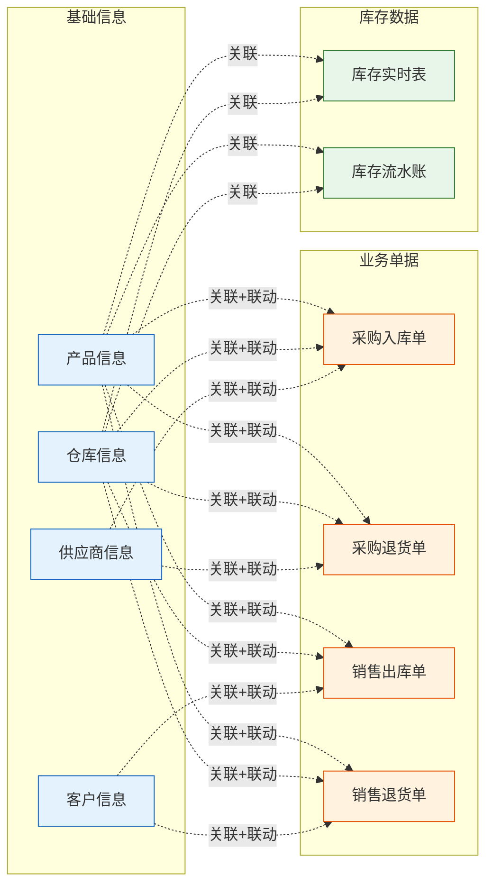
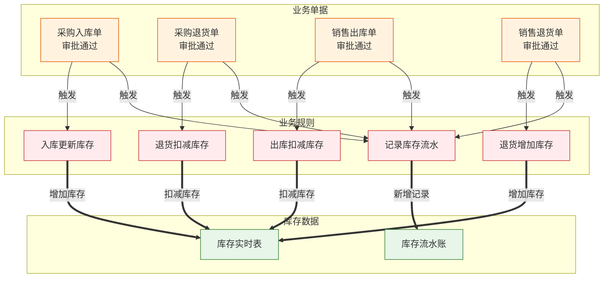

***

# 出入库管理系统关系图谱

# 版本: v4.0.0

# 用途: 单文件记录系统内所有表单的重点功能规则

***

# 出入库管理系统关系图谱

## 一、表单清单

| 序号 | 表单名称  | 表单类型 | 重点功能概述        |
| -- | ----- | ---- | ------------- |
| 1  | 产品信息  | 普通表单 | 基础资料维护        |
| 2  | 仓库信息  | 普通表单 | 基础资料维护        |
| 3  | 供应商信息 | 普通表单 | 基础资料维护        |
| 4  | 客户信息  | 普通表单 | 基础资料维护        |
| 5  | 采购入库单 | 流程表单 | 关联/联动/公式/业务规则 |
| 6  | 采购退货单 | 流程表单 | 关联/联动/公式/业务规则 |
| 7  | 销售出库单 | 流程表单 | 关联/联动/公式/业务规则 |
| 8  | 销售退货单 | 流程表单 | 关联/联动/公式/业务规则 |
| 9  | 库存实时表 | 普通表单 | 业务规则更新        |
| 10 | 库存流水账 | 普通表单 | 业务规则新增        |

***

## 二、表单功能详情

### 2.1 产品信息

#### 1) 公式函数

无

#### 2) 关联表单

无

#### 3) 数据联动

无

#### 4) 字段校验

无

#### 5) 动作代码

无

#### 6) 业务规则

无

#### 7) 集成自动化

无

***

### 2.2 仓库信息

#### 1) 公式函数

无

#### 2) 关联表单

无

#### 3) 数据联动

无

#### 4) 字段校验

无

#### 5) 动作代码

无

#### 6) 业务规则

无

#### 7) 集成自动化

无

***

### 2.3 供应商信息

#### 1) 公式函数

无

#### 2) 关联表单

无

#### 3) 数据联动

无

#### 4) 字段校验

无

#### 5) 动作代码

无

#### 6) 业务规则

无

#### 7) 集成自动化

无

***

### 2.4 客户信息

#### 1) 公式函数：

无

#### 2) 关联表单

无

#### 3) 数据联动

无

#### 4) 字段校验

无

#### 5) 动作代码

无

#### 6) 业务规则

无

#### 7) 集成自动化

无

***

### 2.5 采购入库单

#### 1) 公式函数

| 字段名称  | 公式内容                         | 说明     |
| ----- | ---------------------------- | ------ |
| 入库总金额 | SUMPRODUCT(子表.入库数量, 子表.入库单价) | 汇总子表金额 |
| 入库金额  | 入库数量 × 入库单价                  | 子表公式   |

#### 2) 关联表单

| 字段名称  | 关联表单  | 关联字段  | 填充字段       | 说明      |
| ----- | ----- | ----- | ---------- | ------- |
| 供应商编号 | 供应商信息 | 供应商编号 | 供应商名称      | 填充供应商名称 |
| 仓库编号  | 仓库信息  | 仓库编号  | 仓库名称       | 填充仓库名称  |
| 产品编号  | 产品信息  | 产品编号  | 产品名称/规格/单位 | 子表中使用   |

#### 3) 数据联动

| 目标字段  | 触发字段  | 数据来源表单 | 数据来源字段 | 联动条件        |
| ----- | ----- | ------ | ------ | ----------- |
| 供应商名称 | 供应商编号 | 供应商信息  | 供应商名称  | 供应商编号相等     |
| 仓库名称  | 仓库编号  | 仓库信息   | 仓库名称   | 仓库编号相等      |
| 产品名称  | 产品编号  | 产品信息   | 产品名称   | 产品编号相等      |
| 规格型号  | 产品编号  | 产品信息   | 规格型号   | 产品编号相等      |
| 计量单位  | 产品编号  | 产品信息   | 计量单位   | 产品编号相等      |
| 入库单价  | 产品编号  | 产品信息   | 参考单价   | 产品编号相等（默认值） |

#### 4) 字段校验

| 字段名称 | 校验规则  | 提示信息      |
| ---- | ----- | --------- |
| 入库数量 | 大于0   | 入库数量必须大于0 |
| 入库单价 | 大于等于0 | 入库单价不能为负数 |

#### 5) 动作代码

| 动作类型   | 触发时机  | 功能说明     | 代码位置      |
| ------ | ----- | -------- | --------- |
| 提交前校验  | 表单提交前 | 校验库存是否充足 | 表单设置-表单校验 |
| 审批通过回调 | 审批通过后 | 触发库存更新   | 流程设计-节点回调 |

#### 6) 业务规则

| 规则名称   | 触发条件 | 执行操作   | 目标表单  |
| ------ | ---- | ------ | ----- |
| 入库更新库存 | 审批通过 | 增加库存数量 | 库存实时表 |
| 入库记录流水 | 审批通过 | 新增流水记录 | 库存流水账 |

#### 7) 集成自动化

| 自动化名称  | 触发条件  | 执行操作      | 目标/接口 |
| ------ | ----- | --------- | ----- |
| 库存预警检查 | 库存更新后 | 检查是否低于预警线 | 库存预警表 |

***

### 2.6 采购退货单

#### 1) 公式函数

| 字段名称  | 公式内容                         | 说明     |
| ----- | ---------------------------- | ------ |
| 退货总金额 | SUMPRODUCT(子表.退货数量, 子表.退货单价) | 汇总子表金额 |
| 退货金额  | 退货数量 × 退货单价                  | 子表公式   |

#### 2) 关联表单

| 字段名称  | 关联表单  | 关联字段  | 填充字段       | 说明      |
| ----- | ----- | ----- | ---------- | ------- |
| 供应商编号 | 供应商信息 | 供应商编号 | 供应商名称      | 填充供应商名称 |
| 仓库编号  | 仓库信息  | 仓库编号  | 仓库名称       | 填充仓库名称  |
| 产品编号  | 产品信息  | 产品编号  | 产品名称/规格/单位 | 子表中使用   |
| 原入库单号 | 采购入库单 | 入库单号  | 入库明细       | 关联原入库记录 |

#### 3) 数据联动

| 目标字段  | 触发字段       | 数据来源表单 | 数据来源字段 | 联动条件    |
| ----- | ---------- | ------ | ------ | ------- |
| 供应商名称 | 供应商编号      | 供应商信息  | 供应商名称  | 供应商编号相等 |
| 仓库名称  | 仓库编号       | 仓库信息   | 仓库名称   | 仓库编号相等  |
| 产品名称  | 产品编号       | 产品信息   | 产品名称   | 产品编号相等  |
| 原入库单价 | 原入库单号+产品编号 | 采购入库单  | 入库单价   | 单号和产品相等 |

#### 4) 字段校验

| 字段名称 | 校验规则          | 提示信息          |
| ---- | ------------- | ------------- |
| 退货数量 | 大于0且小于等于原入库数量 | 退货数量不能大于原入库数量 |

#### 5) 动作代码

| 动作类型   | 触发时机  | 功能说明    | 代码位置       |
| ------ | ----- | ------- | ---------- |
| 选择原入库单 | 字段值改变 | 加载原入库明细 | 表单动作-字段值改变 |

#### 6) 业务规则

| 规则名称   | 触发条件 | 执行操作       | 目标表单  |
| ------ | ---- | ---------- | ----- |
| 退货扣减库存 | 审批通过 | 扣减库存数量     | 库存实时表 |
| 退货记录流水 | 审批通过 | 新增流水记录（负数） | 库存流水账 |

#### 7) 集成自动化

无

***

### 2.7 销售出库单

#### 1) 公式函数

| 字段名称  | 公式内容                         | 说明      |
| ----- | ---------------------------- | ------- |
| 出库总金额 | SUMPRODUCT(子表.出库数量, 子表.出库单价) | 汇总子表金额  |
| 出库金额  | 出库数量 × 出库单价                  | 子表公式    |
| 出库单价  | 库存实时表.平均成本                   | 取当前库存成本 |

#### 2) 关联表单

| 字段名称 | 关联表单 | 关联字段 | 填充字段       | 说明     |
| ---- | ---- | ---- | ---------- | ------ |
| 客户编号 | 客户信息 | 客户编号 | 客户名称       | 填充客户名称 |
| 仓库编号 | 仓库信息 | 仓库编号 | 仓库名称       | 填充仓库名称 |
| 产品编号 | 产品信息 | 产品编号 | 产品名称/规格/单位 | 子表中使用  |

#### 3) 数据联动

| 目标字段 | 触发字段      | 数据来源表单 | 数据来源字段 | 联动条件    |
| ---- | --------- | ------ | ------ | ------- |
| 客户名称 | 客户编号      | 客户信息   | 客户名称   | 客户编号相等  |
| 仓库名称 | 仓库编号      | 仓库信息   | 仓库名称   | 仓库编号相等  |
| 产品名称 | 产品编号      | 产品信息   | 产品名称   | 产品编号相等  |
| 当前库存 | 产品编号+仓库编号 | 库存实时表  | 当前库存   | 产品和仓库相等 |

#### 4) 字段校验

| 字段名称 | 校验规则         | 提示信息         |
| ---- | ------------ | ------------ |
| 出库数量 | 大于0且小于等于可用库存 | 出库数量不能大于可用库存 |

#### 5) 动作代码

| 动作类型  | 触发时机  | 功能说明     | 代码位置       |
| ----- | ----- | -------- | ---------- |
| 选择产品  | 字段值改变 | 查询当前库存   | 表单动作-字段值改变 |
| 提交前校验 | 表单提交前 | 校验库存是否充足 | 表单设置-表单校验  |

#### 6) 业务规则

| 规则名称   | 触发条件 | 执行操作   | 目标表单  |
| ------ | ---- | ------ | ----- |
| 出库扣减库存 | 审批通过 | 扣减库存数量 | 库存实时表 |
| 出库记录流水 | 审批通过 | 新增流水记录 | 库存流水账 |

#### 7) 集成自动化

无

***

### 2.8 销售退货单

#### 1) 公式函数

| 字段名称  | 公式内容                         | 说明     |
| ----- | ---------------------------- | ------ |
| 退货总金额 | SUMPRODUCT(子表.退货数量, 子表.退货单价) | 汇总子表金额 |
| 退货金额  | 退货数量 × 退货单价                  | 子表公式   |

#### 2) 关联表单

| 字段名称  | 关联表单  | 关联字段 | 填充字段       | 说明      |
| ----- | ----- | ---- | ---------- | ------- |
| 客户编号  | 客户信息  | 客户编号 | 客户名称       | 填充客户名称  |
| 仓库编号  | 仓库信息  | 仓库编号 | 仓库名称       | 填充仓库名称  |
| 产品编号  | 产品信息  | 产品编号 | 产品名称/规格/单位 | 子表中使用   |
| 原出库单号 | 销售出库单 | 出库单号 | 出库明细       | 关联原出库记录 |

#### 3) 数据联动

| 目标字段  | 触发字段       | 数据来源表单 | 数据来源字段 | 联动条件    |
| ----- | ---------- | ------ | ------ | ------- |
| 客户名称  | 客户编号       | 客户信息   | 客户名称   | 客户编号相等  |
| 仓库名称  | 仓库编号       | 仓库信息   | 仓库名称   | 仓库编号相等  |
| 产品名称  | 产品编号       | 产品信息   | 产品名称   | 产品编号相等  |
| 原出库单价 | 原出库单号+产品编号 | 销售出库单  | 出库单价   | 单号和产品相等 |

#### 4) 字段校验

| 字段名称 | 校验规则          | 提示信息          |
| ---- | ------------- | ------------- |
| 退货数量 | 大于0且小于等于原出库数量 | 退货数量不能大于原出库数量 |

#### 5) 动作代码

| 动作类型   | 触发时机  | 功能说明    | 代码位置       |
| ------ | ----- | ------- | ---------- |
| 选择原出库单 | 字段值改变 | 加载原出库明细 | 表单动作-字段值改变 |

#### 6) 业务规则

| 规则名称   | 触发条件 | 执行操作   | 目标表单  |
| ------ | ---- | ------ | ----- |
| 退货增加库存 | 审批通过 | 增加库存数量 | 库存实时表 |
| 退货记录流水 | 审批通过 | 新增流水记录 | 库存流水账 |

#### 7) 集成自动化

无

***

### 2.9 库存实时表

#### 1) 公式函数

| 字段名称 | 公式内容            | 说明       |
| ---- | --------------- | -------- |
| 当前库存 | 入库数量合计 - 出库数量合计 | 计算实时库存   |
| 可用库存 | 当前库存 - 锁定库存     | 计算可用库存   |
| 平均成本 | 入库金额合计 ÷ 入库数量合计 | 计算加权平均成本 |

#### 2) 关联表单

| 字段名称 | 关联表单 | 关联字段 | 填充字段 | 说明     |
| ---- | ---- | ---- | ---- | ------ |
| 产品编号 | 产品信息 | 产品编号 | 产品名称 | 显示产品信息 |
| 仓库编号 | 仓库信息 | 仓库编号 | 仓库名称 | 显示仓库信息 |

#### 3) 数据联动

无

#### 4) 字段校验

无

#### 5) 动作代码

无

#### 6) 业务规则

无（本表单是被业务规则更新的目标）

#### 7) 集成自动化

无

***

### 2.10 库存流水账

#### 1) 公式函数

无

#### 2) 关联表单

| 字段名称 | 关联表单 | 关联字段 | 填充字段 | 说明     |
| ---- | ---- | ---- | ---- | ------ |
| 产品编号 | 产品信息 | 产品编号 | 产品名称 | 显示产品信息 |
| 仓库编号 | 仓库信息 | 仓库编号 | 仓库名称 | 显示仓库信息 |

#### 3) 数据联动

无

#### 4) 字段校验

无

#### 5) 动作代码

无

#### 6) 业务规则

无（本表单是被业务规则新增记录的目标）

#### 7) 集成自动化

无

***

## 三、表单间关系图

### 3.1 数据引用关系

### 3.2 数据同步关系

***

## 四、更新记录

| 版本   | 时间         | 更新内容          |
| ---- | ---------- | ------------- |
| v1.0 | 2026-03-08 | 初始版本，记录7类重点功能 |

