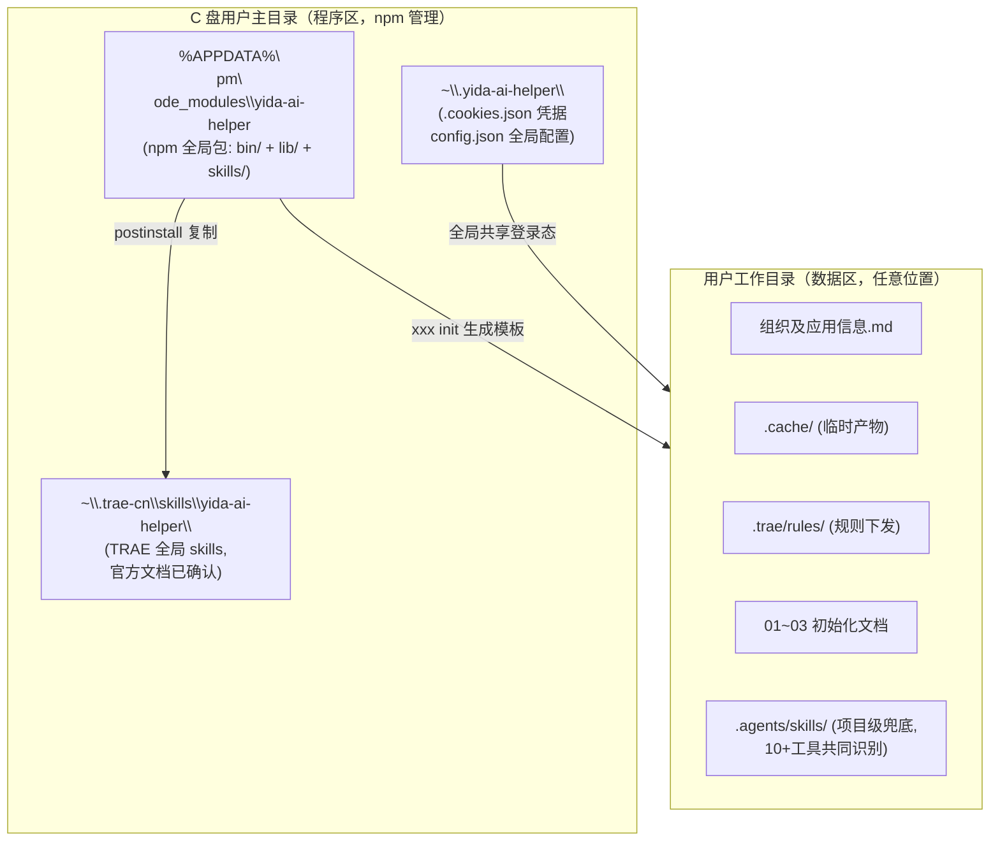
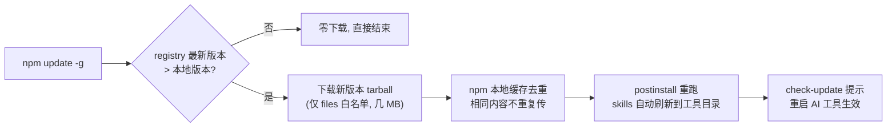

# 宜搭AI助手 GitHub 发布与命令行安装改造方案（执行任务书）

> **文档版本**：v2.0.0
> **创建日期**：2026-08-17
> **文档性质**：⚠️ 本文档是**唯一执行依据**。由执行 AI 按本文档施工，由验收 AI 按第 11 章验收清单检查。执行过程中与项目内其他文档冲突时，凡涉及本次改造范围的事项，以本文档为准
> **参考对象**：[openyida/openyida](https://github.com/openyida/openyida)（钉钉宜搭官方开源 CLI，MIT 协议）
> **改造目标**：项目上传 GitHub，用户通过命令行一键安装、增量更新，摆脱"每次升级下载整个版本压缩包/复制整个目录"的模式

---

## 0. 执行者须知（执行 AI 必读）

### 0.1 角色与节奏

| 角色 | 职责 |
|------|------|
| **执行 AI** | 按第 7 章任务卡逐项施工；每阶段完成后自检并输出阶段报告 |
| **验收 AI** | 按第 11 章验收清单逐项核验；有权打回不符合规格的实现 |
| **用户** | 关键决策点拍板（包名、发布时机等）；阶段间确认放行 |

**执行节奏（强制）**：
1. 严格按阶段一 → 六顺序推进，**每个阶段完成后必须停下来**，输出阶段报告（做了什么/产出文件清单/自检结果/遗留问题），等用户确认后再进入下一阶段
2. 阶段内任务按编号顺序执行；任务间有依赖时不得并行乱序
3. 每个任务卡都带【自检】项，**自检全部通过才算任务完成**，不允许"先跳过以后再补"

### 0.2 硬性禁令（违反任意一条 = 验收直接打回）

| # | 禁令 | 来源 |
|---|------|------|
| B1 | **禁止通过 API 修改任何已有宜搭应用的表单字段/公式/代码**。本次改造是纯工程改造，不碰任何线上宜搭应用；涉及线上操作的任务卡会显式声明 | 项目规则25 |
| B2 | **禁止删除任何已有提示词文件/代码文件**（`*/提示词.md`、skills 下脚本）。只允许任务卡明确列出的文件操作 | 项目规则22 |
| B3 | 临时文件一律放 `temp-file/`，使用完毕必须删除，禁止散落他处 | 项目规则14 |
| B4 | **禁止手写 processJson / 直调 saveProcess 接口**。本次改造不新建任何集成自动化；如需测试现有 integration CLI，只用现有脚本命令 | 集成自动化硬规则1 |
| B5 | 每次新增或更新文件后，同步更新该文件的版本号或变更记录（文档类更新文档头版本，代码类更新文件头注释版本） | 项目规则1 |
| B6 | 禁止在 skill 内容中加入"版本更新说明"类内容 | 项目规则16 |
| B7 | **禁止新建本文档任务卡未要求的 .md 文档**。阶段报告直接输出在对话中，不落盘（任务卡明确要求落盘的除外，如 README/CHANGELOG/迁移指南） | 防文档膨胀 |
| B8 | **修改 skills 时只做任务卡指定的改动**（脚本调用 CLI 化、路径措辞调整），**禁止重写 skill 业务逻辑、重新组织章节、顺手"优化"措辞** | 防跑偏核心 |
| B9 | git 操作：未经用户明确要求，**禁止 commit / push / force 类操作**；`git init` 与 .gitignore 编写允许 | Git 安全 |
| B10 | **任何不确定的点（路径、包名、接口行为、任务歧义），停下来向用户提问，禁止想当然假设** | 项目规则7 |
| B11 | 改造期间**旧目录结构（`.agents/skills/`、现有 `lib/`、`本地操作页面/` 等）保持可用不删除**，直至阶段六验收通过后由用户决定清理时机 | 平滑过渡 |
| B12 | 禁止引入新的构建工具链/框架（保持纯 Node.js 脚本 + CommonJS，与现有代码风格一致） | 防过度工程 |

### 0.3 环境事实（已核实，执行时可直接引用）

| 项 | 值 |
|----|----|
| 项目根目录 | `d:\宜搭AI助手直播\宜搭AI助手V2.0.23` |
| 操作系统 | Windows（PowerShell 环境） |
| Node 版本要求 | >= 18（执行前先跑 `node -v` 核实并把结果写进阶段报告） |
| TRAE 全局 skills 目录 | `%userprofile%\.trae-cn\skills`（官方文档已确认） |
| 本机已装 AI 工具 | trae-cn / codebuddy / qoder / qoder-cn / codex / opencode / cursor / claude / zcode / catpaw（2026-08-17 探测） |
| 现有 skills 数量 | 约 45 个（`.agents/skills/` 下） |
| 现有本地服务 | 8080 静态（server-manager v3.0.0+）+ 3457 同步服务 |

### 0.4 术语约定

| 术语 | 含义 |
|------|------|
| **包名** | npm 发布名，暂定 `yida-ai-helper`（发布前须核实，见任务 5.4） |
| **命令名** | CLI 可执行命令 `yida-helper`（主）/ `yidaazs`（别名），见规格 6.1 |
| **全局数据目录** | `~\.yida-ai-helper\`（Cookie、全局配置） |
| **skills 源目录 → 包内目录** | `.agents/skills/` → 包内 `skills/` |
| **透传模式** | `yida-helper run <相对路径> [args]`，见规格 6.7 |

---

## 1. 背景与目标

### 1.1 当前痛点

| 痛点 | 具体表现 |
|------|---------|
| 升级靠整包复制 | 父目录下已堆积 `V2.0.14 ~ V2.0.23` 共 17 个版本副本，每次升级复制整个目录（含 node_modules、案例库，体积数百 MB） |
| 无命令行入口 | `package.json` 无 `bin` 字段，不能 `npm install -g`，所有能力只能在该目录内的 AI 会话中使用 |
| 代码与数据混杂 | 用户数据（`组织及应用信息.md`、`.cookies.json`、进销存案例）与程序代码（skills、lib、scripts）混在同一目录 |
| 路径强耦合 | 30 处脚本按 `__dirname` 向上 4 层定位项目根 `.cookies.json`；12 个文件硬编码 `宜搭AI助手V2.0.23` / `宜搭AI编程` 路径 |
| 无法多项目复用 | 换一个工作目录就要再复制一份完整项目 |

### 1.2 改造目标

1. **一条命令安装**：`npm install -g <包名>`（或 npx 免安装试用）
2. **增量更新**：`npm update -g <包名>` 只下载变化的新版本包（几 MB），不再复制整目录
3. **skills 全局化**：程序与 skills 安装在 C 盘用户主目录（参考 openyida 机制），用户工作目录只放业务数据
4. **任意目录可用**：用户在任意工作目录 `xxx init` 即可生成项目骨架并开始使用

---

## 2. OpenYida 官方项目调研

### 2.1 项目结构

```text
openyida/                        # GitHub 仓库根 = npm 包根
├── bin/yida.js                  # CLI 入口，命令路由
├── lib/                         # 核心实现（代码）
│   ├── app/                     #   应用、表单、页面、导入导出
│   ├── auth/                    #   OAuth 登录、token 会话存储
│   ├── connector/               #   HTTP 连接器
│   ├── core/                    #   环境检测、i18n、诊断、copy、update
│   ├── process/                 #   流程表单
│   ├── report/                  #   报表
│   └── samples/                 #   代码模板
├── project/                     # 默认项目工作目录模板（仅 config.json + prd 示例，很小）
├── yida-skills/                 # skills 源码（随 npm 包一起发布）
├── scripts/                     # postinstall.js、CI、打包脚本
├── tests/                       # 单测 + E2E
├── docs/
├── package.json                 # bin + files + postinstall 三大关键字段
└── README.md / README_zhCN.md / CHANGELOG.md / LICENSE(MIT)
```

**关键认知**：仓库里只有"程序 + skills + 项目模板"，**没有任何用户数据**。用户数据全部在安装后生成。

### 2.2 分发与安装机制（package.json 三大关键字段）

```json
{
  "name": "openyida",
  "version": "2026.8.17-1",
  "bin": {
    "openyida": "bin/yida.js",     // ① 注册全局命令
    "yida": "bin/yida.js"          //    双命令名等价
  },
  "files": [                        // ② 发包白名单（控制体积的关键）
    "bin/", "lib/", "agent/",
    "project/config.json", "project/prd/demo-*.md",
    "yida-skills/", "scripts/",
    "!scripts/e2e-real/", "!scripts/eval/",
    "docs/capabilities.md", "README.md", "LICENSE"
  ],
  "scripts": {
    "postinstall": "node scripts/postinstall.js"   // ③ 安装后钩子
  },
  "dependencies": {                 // 依赖极少，只有 3 个
    "@babel/standalone": "^7.15.1",
    "ajv": "^8.20.0",
    "uglify-js": "^3.19.3"
  },
  "engines": { "node": ">=18" }
}
```

要点：
- **`files` 白名单**：tests、.github、开发文档全部排除在发包之外 → tarball 很小
- **依赖极少**（3 个）：安装快、冲突少。Playwright 明确**不默认安装**（按需另装）
- **版本号用日期式**（`2026.8.17-1`），一天可发多版

### 2.3 Skills 为什么在 C 盘 —— postinstall 分发机制（核心）

openyida 安装后，`npm install -g openyida` 实际发生的事（源自其 `scripts/postinstall.js` 源码）：

```text
npm 全局包安装位置（Windows: %APPDATA%\npm\node_modules\openyida）
        │
        ▼ postinstall.js 执行
把包内 yida-skills/ 整目录【复制】（不是软链接）到各 AI 工具的全局 skills 目录：
        ~/.claude/skills/yida-skills/          (Claude Code)
        ~/.codex/skills/yida-skills/           (Codex)
        ~/.opencode/skills/yida-skills/        (OpenCode)
        ~/.aone_copilot/skills/yida-skills/    (Aone Copilot)
        ~/.cursor/skills/yida-skills/          (Cursor)
        ~/.qwenworkcn/skills/yida-skills/      (千问办公)
        ~/.qoderwork/skills/yida-skills/       (QoderWork)
        ~/.qoder/skills/yida-skills/           (Qoder)
        ~/.mulerun/skills/yida-skills/         (MuleRun)
```

**设计细节（值得我们照抄）**：

| 细节 | 说明 |
|------|------|
| 用**复制**不用软链接 | 源码注释："确保 AI 工具首次扫描就能发现"。软链接在 Windows 需要特权且部分工具不识别 |
| 统一中间目录 `skills/` | 安装目标固定为 `~/<工具配置>/skills/yida-skills/`，folderName 恒为 `yida-skills` |
| **清理旧版遗留** | postinstall 先 `cleanupLegacy()` 清理历史版本的错误路径（含软链接/目录两种形态），保证升级不留脏数据 |
| 覆盖式更新 | 目标已存在则先删再复制 → 每次安装/升级都是全新内容，无残留旧文件 |
| 悟空例外 | 沙箱环境无法写主目录 → 改为 GitHub Releases 提供 skills zip 手动上传 |
| `openyida copy` 命令 | 手动触发同样的分发逻辑：**不重装包也能刷新各工具目录里的 skills** |

### 2.4 更新机制 —— 为什么不用下载"整个版本压缩包"

openyida 的更新 = 纯 npm 机制，天然增量：

```bash
npm install -g openyida@latest    # 或 npm update -g openyida
```

| 环节 | npm 的行为 | 效果 |
|------|-----------|------|
| 版本检查 | 先向 registry 请求版本元数据（几十 KB） | 版本没变 → **什么都不下载** |
| 包下载 | 只下载新版本 **tarball**，且只含 `files` 白名单内文件 | 几 MB 级别，远小于 git 仓库整包（无 .git、无 tests、无开发文档） |
| 本地缓存 | `~/.npm/_cacache` 内容寻址缓存 | 同版本重复安装/回滚 **零下载** |
| 安装后 | postinstall 自动重跑 | 各 AI 工具目录里的 skills **自动刷新到最新**，用户无感 |
| 辅助提醒 | `lib/core/check-update.js` 启动时对比 registry 最新版 | 有新版时提示用户执行更新命令 |

**结论：用户担心的"每次更新下载整个压缩包"，npm 方案从三个层面天然解决——① 版本未变不下载；② 下载的只是白名单内的小 tarball；③ skills 由 postinstall 自动重新分发，不需要用户手动搬运。**

### 2.5 登录态与项目数据管理

| 内容 | openyida 的做法 | 我们现状 |
|------|----------------|---------|
| 登录凭据 | OAuth token（免 Cookie 导出），存"当前项目缓存" `.cache/` | `.cookies.json` 放项目根（规则26），项目间不共享 |
| 项目数据 | `openyida copy` 把 `project/` 模板复制到当前工作区 | 无独立模板，项目数据与代码同目录 |
| 临时产物 | 统一 `.cache/openyida/` | `temp-file/`（规则14） |

### 2.6 与本项目的渊源（有利条件）

本项目 `.agents/skills/report/scripts/core-lib/` 下已存在 `copy.js`、`doctor.js`、`env.js`、`check-update.js`、`i18n.js`、`command-manifest.js`、`locales/`（12 语言包）等与 openyida `lib/core/` **同构的文件**——说明项目此前已部分移植过 openyida 代码，改造成本进一步降低。

---

## 3. 我们项目的现状与差距

### 3.1 结构对比

| 维度 | openyida | 宜搭AI助手 V2.0.23 | 差距 |
|------|----------|-------------------|------|
| CLI 入口 | `bin/yida.js` + bin 字段 | ❌ 无 bin 字段 | 需新建 |
| 发包白名单 | files 字段严格过滤 | ❌ 无 files，仓库即全量 | 需新增 |
| 安装后钩子 | postinstall 分发 skills | ❌ 无 | 需新建 |
| skills 位置 | 包内 `yida-skills/` → 复制到 `~/各工具/skills/` | `.agents/skills/`（项目内，约 45 个 skill） | 需迁移+适配 |
| 用户数据 | 仓库零用户数据，`project/` 模板极小 | `组织及应用信息.md`、`.cookies.json`、进销存6/7、案例库全在仓库 | 需剥离 |
| 登录态 | OAuth token | Cookie 文件 + `__dirname` 上溯 4 层定位 | 需解耦 |
| 硬编码路径 | 无 | 12 个文件硬编码版本目录名 | 需清理 |
| 版本升级 | `npm update -g` | 复制整个目录（17 个副本为证） | 本方案核心目标 |

### 3.2 必须解决的耦合点清单

1. **Cookie 定位逻辑**（约 30 处引用）：`path.resolve(__dirname, '..', '..', '..', '..', '.cookies.json')` —— 该逻辑假设"skill 脚本在项目内 4 层以下"，一旦 skills 移到 `~/.xxx/skills/` 全部失效
2. **硬编码路径**（12 个文件）：`宜搭AI助手V2.0.23`、`D:\宜搭AI编程\宜搭AI助手V1.7.3` 等
3. **server-manager 多项目机制**：静态根 = 项目父目录、URL 带 `{项目目录名}` 段 —— 该设计服务于"多版本副本并存"，改造后应改为"用户工作目录"导向
4. **`.trae/rules/yida-yeqiu.md`**：TRAE 项目级规则，需随 `init` 下发到用户项目
5. **`01/02/03` 初始化文档**：内含真实 URL（含项目目录名），需模板化
6. **skill 内部相对引用**：部分 skill 的 SKILL.md 引用项目根下的 `组织及应用信息.md` 等数据文件

---

## 4. 改造总体架构

### 4.1 核心理念：代码与数据彻底分离



### 4.2 目标目录布局

**npm 包内（随 GitHub 仓库发布）**：

```text
yida-ai-helper/                   # GitHub 仓库 = npm 包
├── bin/cli.js                    # CLI 入口（命令：init/login/update/copy/doctor/start...）
├── lib/                          # 核心代码（现有 lib/ 迁入并扩展）
│   ├── core/                     #   路径解析、cookie管理、http、update检查
│   ├── cli/                      #   init/login/update/copy/doctor 子命令
│   └── sync-server/              #   现有同步服务
├── skills/                       # 全部 skill（从 .agents/skills/ 迁移）
├── templates/                    # 项目模板（01/02/03 文档模板、组织及应用信息模板、.trae/rules、本地操作页面）
├── scripts/
│   └── postinstall.js            # 参考 openyida：清理遗留 + 复制 skills 到各工具目录
├── tests/
├── package.json                  # bin + files + postinstall
├── .gitignore                    # 排除所有用户数据
├── .npmignore                    # 排除 tests/.github/开发文档
├── README.md / LICENSE / CHANGELOG.md
└── .github/workflows/publish.yml # tag → 自动 npm publish + GitHub Release
```

**用户机器上（安装后）**：

```text
%APPDATA%\npm\                    # npm 全局区
└── node_modules\yida-ai-helper\  # 程序本体（npm update 只更新这里）

~\.yida-ai-helper\                # 全局数据区（新增）
├── .cookies.json                 # 登录态（所有项目共享一份）
└── config.json                   # 全局配置（默认组织等）

~\.trae-cn\skills\yida-ai-helper\ # TRAE 全局 skills（官方文档已确认）
~\.codex\skills\yida-ai-helper\   # Codex 全局（其余工具见规格 6.5 映射表）
                                   # init 亦可选择项目级 .agents/skills/ 兜底

D:\用户的任意工作目录\              # 用户数据区（xxx init 生成）
├── 组织及应用信息.md
├── 01环境初始化.md / 02应用初始化.md / 03常用提示词.md
├── .trae/rules/yida-yeqiu.md
├── .agents/skills/               # （退化方案时）
└── .cache/
```

### 4.3 改造后的用户体验

```bash
# ① 安装（一次）
npm install -g yidaai

# ② 进入任意工作目录，初始化项目
cd D:\我的宜搭项目
yida-helper init          # 生成组织及应用信息.md 模板、01/02/03 文档、.trae/rules、skills（如需项目级）

# ③ 登录（全局一次，所有项目共用）
yida-helper login         # 扫码/CDP 登录 → ~\.yida-ai-helper\.cookies.json

# ④ 启动本地服务
yida-helper start         # 即现在的 server-manager，静态根改为当前工作目录

# ⑤ 日常在 TRAE 里对话使用（skills 已就位）

# ⑥ 更新（只下载几 MB 新包，skills 自动刷新）
npm update -g yida-ai-helper
yida-helper copy          # （可选）手动重新分发 skills 到各工具目录
```

---

## 5. 多工具适配与验证策略（v1.1.0 新增）

### 5.1 openyida 多工具适配的原理（回答"他们是怎么做到的"）

openyida 官宣支持多个 AI 工具，其原理并不神秘，拆开看就四件事：

1. **skills 格式标准化**：`SKILL.md` + YAML frontmatter（name/description）是全行业事实标准（agentskills.io 规范）。skill 内容本身规范，就不存在"为某个工具重写"的问题
2. **静态目录映射表**：postinstall 内置一张"工具 → 全局 skills 目录"映射表（`~/.claude`、`~/.codex`、`~/.cursor`、`~/.qoder`、`~/.qwenworkcn` 等约 10 个）
3. **探测式写入**：逐个检查用户主目录下该工具的配置目录是否存在，**存在才复制，未安装自动跳过**（不报错、不产生垃圾目录）
4. **全量复制 + 清理遗留**：覆盖式更新 + `cleanupLegacy()` 清掉历史版本的错误路径

它**不需要**对每个工具做深度定制，也不需要在每台机器上装齐所有工具从零测试——路径约定是公开的、格式是标准的，新工具路径靠社区 PR 共建补充。

另一个更权威的参考：**vercel-labs/skills**（Vercel 官方开源的 skills 安装 CLI，即 `npx skills add`）用同样机制支持了 **75+ 工具**，其 README 的路径映射表是业内最全、经社区验证的权威对照表。我们的路径约定直接采用"该表 + TRAE/CodeBuddy 官方文档"，无需从零摸索。

### 5.2 重大有利发现：`.agents/skills/` 是跨工具事实标准

当前项目把 skills 放在 `.agents/skills/`——这不是 TRAE 专属路径，而是**跨工具的项目级事实标准**（vercel-labs 路径表确认）：

| 采用 `.agents/skills/` 作为项目级 skills 路径的工具 |
|---|
| Cursor、Codex、OpenCode、GitHub Copilot、Gemini CLI、Amp、Antigravity、Cline、Warp、Zed、Kimi Code CLI、Firebender、Deep Agents、**TRAE（当前项目即实证）** |

**结论：项目级分发天然多工具兼容**——用户项目里放一份 `.agents/skills/`，上述所有工具打开该项目都能识别；全局级才需要按工具逐个复制到 `~/工具目录/skills/`。

### 5.3 目标工具适配矩阵

路径来源：TRAE 官方文档 + vercel-labs/skills 权威表 + CodeBuddy 官方文档；"本机已装"为 2026-08-17 实际探测结果（**本机已装齐全部目标工具，均可零成本实测**）：

| 工具 | 项目级路径 | 全局路径 | 本机已装 | 优先级 | 状态 |
|------|-----------|---------|:--:|:--:|------|
| **TRAE CN（IDE）** | `.trae/skills/`（兼容 `.agents/skills/`） | `%userprofile%\.trae-cn\skills` | ✅ | **P0 主力** | **一层结构已实测识别（2026-08-18），两层套壳不识别** |
| TraeCode CLI | `.traecli/skills/` | `~/.traecli/skills/` | ❌ | P1 | 官方文档确认 |
| **Codex** | `.agents/skills/` | `~/.codex/skills/` | ✅ | **P1 用户点名** | 权威表确认，待探针实测 |
| **OpenCode** | `.agents/skills/` | `~/.config/opencode/skills/` | ✅ | **P1 用户点名** | 权威表确认，待探针实测 |
| **CodeBuddy（腾讯）** | `.codebuddy/skills/` | `~/.codebuddy/skills/` | ✅ | **P1 用户点名** | 官方文档确认，待探针实测 |
| **Qoder** | `.qoder/skills/` | `~/.qoder/skills/` | ✅ | **P1 用户点名** | 权威表确认，待探针实测 |
| Qoder CN | `.qoder/skills/` | `~/.qoder-cn/skills/` | ✅ | P1 | 权威表确认 |
| **ZCode** | `.zcode/skills/` | `~/.zcode/skills/` | ✅ | **P1 用户点名** | 权威表确认，待探针实测 |
| **CatPaw（美团）** | 未公开 | 未公开 | ✅ | P2 观察项 | Windows 版仍在开发，skills 目录未标准化，vercel-labs 亦未收录（见下方说明） |
| Claude Code | `.claude/skills/` | `~/.claude/skills/` | ✅ | P1 顺带 | openyida/权威表确认 |
| Cursor | `.agents/skills/` | `~/.cursor/skills/` | ✅ | P1 顺带 | 权威表确认 |

> **CatPaw 说明**：美团 2025-11 公测的新 IDE，官方文档尚未公开自定义 skills 目录约定（宣传"技能库开箱即用"）。策略：postinstall 预留槽位，待官方文档发布后补充；期间可尝试项目级 `.agents/skills/`（CatPaw 兼容 VS Code 生态，大概率识别）。

### 5.4 验证策略（回答"是不是每个工具都要测"）

**不需要每个工具都从零深度测试。** 采用三层漏斗，成本从低到高：


| 层级 | 验证什么 | 怎么做 | 覆盖范围 |
|------|---------|--------|---------|
| **L1 路径正确性** | 目录约定对不对 | 对照 vercel-labs/skills 权威表 + 各工具官方文档（5.3 矩阵即产出） | 全部 11 个，零成本 |
| **L2 加载验证** | 放进去能否被识别 | 统一探针法（5.5），本机已装的 10 个工具逐一跑 | 本机 10 个 |
| **L3 深度适配** | skill 能否真实触发并跑通脚本 | 真实业务 skill 端到端（建应用→生成公式→同步配置→回读验证） | P0：TRAE；P1：Codex/OpenCode/CodeBuddy/Qoder/ZCode |

openyida 的做法印证了此策略：其 CI 只做三平台（win/mac/linux）安装脚本矩阵验证，多工具路径靠社区共建；深度功能验证集中在少数主力工具，其余工具依赖"标准格式 + 正确路径"的约定保证。

### 5.5 统一探针验证法（L2 操作手册）

用一个最小 skill 作为探针，所有工具验证流程一致、可脚本化：

1. **制造探针**：复制现有 `hello-world-custom` skill（触发词"测试自定义Skill"）
2. **投放**：复制到目标工具全局 skills 目录（如 `~\.codex\skills\hello-world-custom\`）
3. **重启该工具**（skills 均为启动时扫描加载）
4. **验证识别**：
   - TRAE：新开会话 → 查看系统 available_skills 列表 / 输入"测试自定义skill"
   - CodeBuddy：对话框输入 `list skills`（官方文档提供的检测命令）
   - Codex / OpenCode / Qoder / ZCode / Claude Code / Cursor：新会话输入"你好，测试自定义skill"
5. **回填结果**：更新 5.3 矩阵"状态"列
6. **清理探针**：验证通过后删除

### 5.6 SKILL.md 内容的多工具兼容改造

路径分发解决"放哪"，内容改造解决"能不能跑"。三个必改点：

| # | 问题 | 现状 | 改造方案 |
|---|------|------|---------|
| 1 | **脚本调用方式（核心）** | `node .agents/skills/xxx/scripts/xxx.js` 项目相对路径，离开本项目即失效 | 统一改 `yida-helper <command>` 全局 CLI 命令——任何工具、任何目录都有效（openyida 同款做法，其 skills 全部调用 `openyida xxx`） |
| 2 | 数据文件引用 | SKILL.md 引用"项目根的组织及应用信息.md" | 改为"当前工作目录"措辞；`yida-helper doctor` 诊断数据文件缺失并引导 init |
| 3 | frontmatter 格式 | 现有 name/description 已符合 agentskills.io 规范 | 各工具均只要求 name+description，无需改动，仅做兼容性巡检 |

**验证推进顺序**：TRAE（P0，主力工具，改造期间开发不能停）→ CLI 化完成后并行验证 Codex/OpenCode → CodeBuddy/Qoder/Qoder CN/ZCode（国产，本机已装）→ CatPaw（观察项）。

---

## 6. 关键实现规格（代码级，执行 AI 严格照此实现）

> 本章是"任务卡"的代码级补充。任务卡负责"做什么"，本章负责"做成什么样"。两者冲突时以本章为准。

### 6.1 包名、命令名与版本号

| 项 | 决定值 | 说明 |
|----|--------|------|
| npm 包名 | `yida-ai-helper`（发布前核实占用，见任务 5.4） | 备选 `yida-assistant` / `@yida-ai/helper` |
| 主命令 | `yida-helper` | `package.json` bin 主键 |
| 别名命令 | `yidaazs` | bin 别名键，指向同一入口 |
| 首个发布版本 | `3.0.0` | 语义化，标志架构升级（与旧"V2.x"彻底区分） |
| Node engines | `>=18` | |

**`package.json` 关键字段目标形态**（以此为准实现）：

```json
{
  "name": "yida-ai-helper",
  "version": "3.0.0",
  "bin": {
    "yida-helper": "bin/cli.js",
    "yidaazs": "bin/cli.js"
  },
  "main": "lib/index.js",
  "files": [
    "bin/", "lib/", "skills/", "templates/",
    "scripts/postinstall.js",
    "README.md", "LICENSE", "CHANGELOG.md"
  ],
  "scripts": {
    "postinstall": "node scripts/postinstall.js"
  },
  "engines": { "node": ">=18" }
}
```

### 6.2 依赖策略

| 依赖 | 处理 | 理由 |
|------|------|------|
| `http-server` | **移除** | server-manager 已内置静态服务，避免双重服务器 |
| `playwright` / `playwright-core` | **移到 `optionalDependencies`** | 不强制随主包安装，首次需要时提示单独安装（对应"依赖极少"原则） |
| `xlsx` | **保持普通依赖**，但 `lib/` 内改为 `require` 延迟加载（用到时才 require，不阻塞冷启动） | 数据导出是核心能力，不能缺 |
| 其余现有依赖 | 保持，评估是否整包带入（见任务 1.3） | |

### 6.3 包内目录 → 来源目录映射（只迁不删，见禁令 B11）

| 包内路径 | 来源（现有项目） | 处理 |
|----------|-----------------|------|
| `skills/` | `.agents/skills/` | 复制迁移（原目录保留） |
| `lib/` | 现有 `lib/` | 复制迁移并扩展 |
| `lib/core/paths.js` | 新建 | 路径解析唯一入口 |
| `templates/` | `01环境初始化.md`、`02应用初始化.md`、`03常用提示词.md`、`组织及应用信息.md`、`.trae/rules/*`、`本地操作页面/` | 收敛为模板，占位符在 `init` 时填充 |
| `scripts/postinstall.js` | 新建 | 见规格 6.5 |
| `bin/cli.js` | 新建 | 见规格 6.6 |

### 6.4 `lib/core/paths.js` 规格（唯一路径入口）

导出函数（CommonJS）：

```js
paths.homeDir()              // 用户主目录（os.homedir()）
paths.dataDir()              // 全局数据目录：env.YIDA_HELPER_HOME > ~/.yida-ai-helper
paths.cookieFile()           // dataDir + '.cookies.json'
paths.configFile()           // dataDir + 'config.json'
paths.packageRoot()          // 本包安装根（module 内部定位，勿用 process.cwd()）
paths.skillsSource()         // packageRoot + 'skills'
paths.resolveDataFile(name)  // 项目数据文件：cwd 下找，找不到再找 dataDir
paths.projectDir(cwd)        // 显式参数 --project-dir > 环境变量 > cwd
```

**Cookie 解析优先级（取代旧的 `__dirname 上溯4层`）**：
1. 环境变量 `YIDA_HELPER_HOME` 指向的目录
2. `~\.yida-ai-helper\.cookies.json`
3. 兼容回退：`process.cwd()` 下 `.cookies.json`（老项目不断档）

> 规则26 将同步更新为"优先全局、兼容项目根"。

### 6.5 多工具全局 skills 分发映射表（postinstall 与 `copy` 共用）

postinstall 按**探测式写入**：目标目录存在才复制，不存在自动跳过（不报错、不建垃圾目录）。复制目标是**包内 `skills/` 整目录 → `<全局skills目录>/yida-ai-helper/`**（folderName 恒为 `yida-ai-helper`）。

| # | 工具 | 全局 skills 目录（Windows） | 备注 |
|---|------|----------------------------|------|
| 1 | TRAE CN（国内版） | `%USERPROFILE%\.trae-cn\skills\` | P0 主力 |
| 2 | TraeCode CLI | `%USERPROFILE%\.traecli\skills\` | 官方文档确认 |
| 3 | Codex | `%USERPROFILE%\.codex\skills\` | |
| 4 | OpenCode | `%USERPROFILE%\.config\opencode\skills\` | |
| 5 | CodeBuddy | `%USERPROFILE%\.codebuddy\skills\` | |
| 6 | Qoder | `%USERPROFILE%\.qoder\skills\` | |
| 7 | Qoder CN | `%USERPROFILE%\.qoder-cn\skills\` | |
| 8 | ZCode | `%USERPROFILE%\.zcode\skills\` | |
| 9 | Claude Code | `%USERPROFILE%\.claude\skills\` | |
| 10 | Cursor | `%USERPROFILE%\.cursor\skills\` | |
| 11 | CatPaw | 未公开 → **预留槽位** | 官方发布路径后补充；当前仅记录不写入 |

**postinstall 执行流程（照抄 openyida 结构）**：
1. `cleanupLegacy()`：清理历史版本遗留的旧路径目录（含软链接/目录两种形态，先探测后删除，删除前打印日志）
2. 遍历上表：目标目录存在 → 若已有 `yida-ai-helper/` 先删 → 复制 `skills/` 为 `yida-ai-helper/`
3. 全程 try/catch，任何单个工具失败不阻断整体，汇总打印"已安装到 X 个工具"

### 6.6 CLI 命令规格（`bin/cli.js` 路由）

| 命令 | 参数 | 行为 | 对应任务 |
|------|------|------|---------|
| `yida-helper init` | `[--project-dir <路径>] [--with-skills]` | 在目标目录生成项目骨架（templates 渲染 + 占位符填充）；`--with-skills` 时复制 skills 到 `./.agents/skills/`；生成 `.gitignore` | 3.1 |
| `yida-helper login` | `[--method auto]` | 复用 auth-plus 多策略登录，凭据写入全局 `cookieFile()` | 3.2 |
| `yida-helper logout` | - | 删除全局 Cookie | 3.2 |
| `yida-helper copy` | `[--tool <name>] [--project <路径>]` | 无参=按 6.5 表全量重分发；`--tool` 指定单个；`--project` 刷新指定项目 `.agents/skills/` | 3.3 |
| `yida-helper start` | `[--port 8080]` | 封装 server-manager，静态根= cwd（`--project-dir` 可指定） | 3.4 |
| `yida-helper stop` / `status` | - | 停止/查询本地服务 | 3.4 |
| `yida-helper doctor` | - | 环境体检，输出结构化报告（见任务 3.5） | 3.5 |
| `yida-helper update` | `[--yes]` | 对比 registry 最新版 → 提示 → 执行 `npm install -g yidaai@latest` → 自动跑 copy | 3.6 |
| `yida-helper version` | - | 打印包版本 | 1.2 |
| `yida-helper help` | - | 打印命令表 | 1.2 |
| `yida-helper migrate` | `<老项目路径>` | 老数据迁移（见任务 6.2） | 6.2 |
| **`yida-helper run`** | `<相对路径> [args...]` | **透传模式**（见规格 6.7），SKILL.md 统一调用此命令 | 4.3 |

命令行解析：用现有 `core-lib/command-manifest.js` 的机制扩展，不引入 commander 等新依赖（禁令 B12）。

### 6.7 透传模式（多工具 SKILL.md 调用的关键设计）

**背景**：45 个 skill 的脚本被 `node .agents/skills/xxx/scripts/xxx.js` 相对路径调用，复制到其他工具/目录后相对路径失效。但要保证"任何工具、任何 cwd"都能跑，全部改写成本太高。

**方案**：`yida-helper run <相对路径> [args...]` —— 以包内 `skills/` 为根解析相对路径后透传给 `node` 执行：

```bash
# 原：node .agents/skills/integration/scripts/integration-create.js ...
# 新：yida-helper run integration/scripts/integration-create.js ...
```

**实现要点**：
- `run` 把 `<相对路径>` 解析为 `packageRoot/skills/<相对路径>`，`process.chdir()` 到该脚本所在 skill 目录（保证脚本内相对引用、数据文件查找行为一致），再 `spawn(node, [...args])` 透传参数与 stdio
- **执行顺序（重要）**：先做"纯读"改造——`copy`/postinstall 用**原始 skills 目录**复制；`run` 在复制后的全局目录里**按相对路径**执行。这样所有 skill 脚本**无需逐行改内部逻辑**，只把 SKILL.md 里的调用命令从绝对/相对 `node` 改成 `yida-helper run <相对路径>` 即可
- 阶段性做法（任务 4.3）：SKILL.md 中凡形如 `node .agents/skills/<skill>/scripts/xxx.js` 的调用，替换为 `yida-helper run <skill>/scripts/xxx.js`；`yida-helper run` 对缺失路径报"脚本不存在：<相对路径>"并给出真实可用路径提示

### 6.8 server-manager 改造要点（任务 2.4 的代码级补充）

| 现状 | 目标 |
|------|------|
| 静态根 = 项目父目录（`d:\宜搭AI助手直播`），URL 带 `{项目目录名}` 段 | 静态根 = cwd（`--project-dir` 可指定），URL 模板 `http://127.0.0.1:8080/index.html` |
| 多版本副本并存兼容逻辑 | 保留"一工作区多项目"能力：`--project-dir <子目录>` 时静态根切到该子目录 |
| `/__yida_health` 健康检查 | 保留（回归测试依赖） |
| 旧 URL 回退逻辑 | 保留（老访问不 404） |
| `updateInitDoc()` 占位符替换 | 保留，但占位符从"项目目录名"改为"用户自定义工作目录名" |

**改造后 URL 模板（写入所有模板文档与 SKILL.md 规则）**：`http://127.0.0.1:8080/index.html`（单项目工作区）/ `http://127.0.0.1:8080/{子目录名}/index.html`（多项目工作区）。

---

## 7. 分阶段改造任务清单

### 阶段一：包化改造（基础设施）

> 目标：把仓库变成可发布的 npm 包雏形。本阶段不迁移 skills、不改业务代码。

**任务 1.1 重写 `package.json`**
- 按规格 6.1 的形态实现（name/version/bin/files/main/scripts.postinstall/engines）
- 保留现有 scripts 中与项目开发相关的其他命令；新增 `postinstall`
- 产物：`package.json`
- 【自检】`bin` 两个键均指向 `bin/cli.js`；`files` 覆盖 6.1 所列全部目录；无 `process.cwd()` 依赖

**任务 1.2 新建 `bin/cli.js`（命令路由骨架）**
- 按规格 6.6 的命令表建立路由；命令未实现时输出 "not implemented"
- 引入 `lib/core/paths.js`（先建最小可用版，见任务 2.1 完整版）
- 【自检】`node bin/cli.js help` 打印全部命令表；`node bin/cli.js version` 输出 3.0.0

**任务 1.3 依赖瘦身**
- 按规格 6.2：移除 `http-server`；`playwright`/`playwright-core` 移入 `optionalDependencies`；`xlsx` 改延迟加载（`lib/` 中 require 下沉到使用函数内部）
- 输出一份 `依赖变更说明`（阶段报告中列出增删改每一项）
- 【自检】`npm ls --omit=optional` 无残留 `http-server`；冷启动 `node bin/cli.js version` 不加载 `xlsx`

**任务 1.4 建 `templates/` 目录**
- 按规格 6.3 把 6 类文件收敛进 `templates/`；内部真实 URL/项目目录名一律改为占位符 `{{PROJECT_NAME}}`、`{{YIDA_URL}}` 等，由 `init` 渲染替换
- 保留源文件原位置（B11），templates 是副本
- 【自检】templates 内无真实路径、无 `宜搭AI助手V2.0.23` 字样（用 Grep 验证）

---

### 阶段二：路径解耦（最关键、工作量最大）

> 目标：消灭 `__dirname 上溯` 与硬编码路径，让代码"放哪里都能跑"。

**任务 2.1 完整实现 `lib/core/paths.js`**
- 按规格 6.4 全部导出函数，补全任务 1.2 的最小版
- 【自检】写一个 10 行冒烟脚本调用每个函数，输出符合预期（阶段报告贴输出）

**任务 2.2 改造 Cookie 读取（约 30 处）**
- 先写扫描脚本（放 `temp-file/`，用后删）：Grep 出所有 `__dirname` 上溯 4 层定位 `.cookies.json` 的代码
- 逐一替换为 `paths.cookieFile()`；同步更新规则文档（`yida-yeqiu.md` 规则26 改为"优先全局、兼容项目根"）
- 【自检】扫描脚本复核：替换后全库无残留 `resolve(__dirname,'..','..','..','..','.cookies.json')` 模式；老项目（仅项目根有 cookies）仍能读到（临时造一个验证）

**任务 2.3 清理 12 个文件的硬编码路径**
- Grep `宜搭AI助手V2.0.23` / `D:\宜搭AI编程`，逐个改为 `paths.*` / `process.cwd()` / CLI 参数
- 【自检】Grep 全库（排除 temp-file、node_modules）无版本目录名硬编码

**任务 2.4 server-manager 改造**
- 按规格 6.8 实施：静态根默认 cwd、URL 模板更新、保留健康检查与旧 URL 回退
- 【自检】`yida-helper start` 后访问 `http://127.0.0.1:8080/index.html` 正常；`/__yida_health` 返回 cwd 与版本

**任务 2.5 skills 数据引用参数化**
- 所有 SKILL.md 与脚本中"读项目根 `组织及应用信息.md`"改为"读当前工作目录同名文件"措辞；脚本增加 `--project-dir`（默认 cwd）
- 【自检】挑 3 个代表性 skill（如 config-sync、form-settings、report）在临时目录执行，能正确解析工作目录

---

### 阶段三：CLI 核心命令

> 目标：`yida-helper` 覆盖日常高频操作。实现按规格 6.6，逐个落地。

| # | 命令 | 验收要点 |
|---|------|---------|
| 3.1 | `yida-helper init` | 空目录执行后生成完整项目骨架；`--with-skills` 生成 `.agents/skills/`；生成的 `组织及应用信息.md` 为模板（无真实数据） |
| 3.2 | `yida-helper login` / `logout` | 登录成功写入全局 `~\.yida-ai-helper\.cookies.json`；切换工作目录无需重登 |
| 3.3 | `yida-helper copy` | 按规格 6.5 表重分发；`--tool codex` 只刷新 Codex；`--project <路径>` 刷新项目级 |
| 3.4 | `yida-helper start` / `stop` / `status` | 能启动/停止本地服务；`status` 输出端口与健康状态 |
| 3.5 | `yida-helper doctor` | 结构化报告含：Node 版本、登录态（Cookie 存在性）、Playwright 可用性、端口占用、各工具 skills 分发状态、npm 最新版 |
| 3.6 | `yida-helper update` | `--yes` 静默执行；默认交互式确认；完成后自动调用 copy 逻辑 |

- 【自检】逐条执行上表验收要点，全部通过后进入阶段四

---

### 阶段四：skills 分发适配（多工具）

> 目标：skills 在"任何已装 AI 工具 + 任何 cwd"下都能被识别并执行。

**任务 4.1 探针验证全局 skills 目录（L2，全工具）**
- 按 5.5 探针法，对规格 6.5 表中本机已装的工具逐一投放 `hello-world-custom` 探针并回填结果到 5.3 矩阵"状态"列
- 至少覆盖：TRAE CN、Codex、OpenCode、CodeBuddy、Qoder、ZCode（用户点名项必须全测）
- 【自检】用户点名的 6 个工具探针全部通过；不通过的记录原因并更新矩阵

**任务 4.2 编写 `scripts/postinstall.js`（多工具版）**
- 按规格 6.5 的映射表与执行流程实现（cleanupLegacy → 探测式复制 → 汇总报告）
- 复用 `lib/core/paths.js` 的 `skillsSource()`
- 【自检】在临时全局目录模拟安装（`npm pack` → 解包 → 手动跑 postinstall），打印"已安装到 N 个工具"，N 与本机工具数一致

**任务 4.3 SKILL.md 脚本调用收敛（透传模式落地）**
- 按规格 6.7 实现 `yida-helper run`；然后批量把 SKILL.md 中 `node .agents/skills/<skill>/scripts/xxx.js` 替换为 `yida-helper run <skill>/scripts/xxx.js`
- ⚠️ 只改调用命令，不碰脚本内部逻辑（B8）
- 替换清单（skill → 涉及文件数）写入阶段报告
- 【自检】抽查 3 个被改的 SKILL.md，命令与脚本实际相对路径一致；`yida-helper run` 在"任意 cwd"下可执行该脚本

**任务 4.4 项目级兜底**
- `init --with-skills` 与 `copy --project` 走 `.agents/skills/` 复制（多工具共同识别）
- 【自检】用 `init --with-skills` 生成的临时项目，TRAE 打开可识别 skills

**任务 4.5 skill 内部清理（压缩包体积）**
- 删除调试截图（integration/scripts 下 .png）、`.form-counter` 等运行时产物；只删明确列出的类型（B2）
- 清理前先 Grep 列出清单给用户过目确认
- 【自检】`npm pack --dry-run` 输出 tarball 体积 < 20MB，且无 .png/.form-counter 残留

---

### 阶段五：GitHub 仓库与发布流水线

> 目标：可发布、可安装、可自动发版。本阶段首次真正触发 `npm publish`（需用户拍板）。

**任务 5.1 完善 `.gitignore` / `.npmignore`**
- `.gitignore` 排除：`node_modules/`、`.cache/`、`temp-file/`、`.cookies.json`、`组织及应用信息.md`（真实数据）、`进销存*/`、`★宜搭*/`、`.idea/`、`*.log`
- `.npmignore` 排除：tests、.github、开发文档、temp-file（`files` 白名单已兜底，.npmignore 作为补充）
- 【自检】`git status` 无敏感文件；`npm pack --dry-run` 文件清单符合预期

**任务 5.2 敏感信息审计**
- 扫描全仓：真实 appId / formUuid / 内网地址 / 个人路径 / Cookie 内容；命中项列入清单，替换为示例值或排除
- 【自检】审计清单为空（或全部已处理）；`git grep` 无 `.cookies.json` 内容

**任务 5.3 GitHub Actions `publish.yml`**
- 触发：tag `v*` → 三平台（win/mac/linux）`npm install -g` 冒烟 → `npm publish` → 创建 GitHub Release（附 `skills.zip`）
- 复用现有 CI 经验（openyida 三平台矩阵）
- 【自检】工作流语法通过 actionlint（若不可用则人工核对 YAML）

**任务 5.4 npm 包名注册（需用户拍板）**
- 先向用户确认包名，再到 npmjs.com 核实占用后发布
- 【自检】`npm info yida-ai-helper` 返回我们的 3.0.0

**任务 5.5 仓库文档**
- `README.md`（安装/快速开始/命令表/多工具支持表）、`CHANGELOG.md`、`LICENSE`（MIT）
- 【自检】README 的安装命令在新机器可复现

---

### 阶段六：老用户迁移

> 目标：老项目无感过渡 + 提供迁移路径。涉及线上数据，必须用户确认后逐项执行。

**任务 6.1 兼容模式确认**
- 验证老项目（项目根有 `.cookies.json`、`组织及应用信息.md`）在未 `init` 情况下功能不回退
- 【自检】用本机真实老项目（如 V2.0.21）做一次冒烟，结果写入阶段报告

**任务 6.2 实现 `yida-helper migrate <老项目路径>`**
- 行为：复制 `组织及应用信息.md` 等数据到新工作目录 → 提示 Cookie 迁移到全局 → 输出清理老副本建议（不自动删除）
- 【自检】在临时目录跑通迁移，数据文件完好

**任务 6.3 迁移文档**
- 《从 V2.x 整包模式迁移到 V3.x 命令行模式》（本任务允许新增 .md，B7 例外）
- 【自检】文档步骤在临时目录实测可复现

---

## 8. 更新机制详解（对应"不下载整包"诉求）

### 8.1 三层增量保障



1. **版本级**：npm 先查 registry 元数据，版本未变不产生任何下载
2. **包级**：tarball 只含 `files` 白名单（bin/lib/skills/templates），排除 tests、.git、开发文档 —— 预估 5~15 MB，对比现在整目录数百 MB 缩小一个数量级
3. **文件级缓存**：npm 内容寻址缓存，同版本重装/回滚零流量

### 8.2 二期可选：自研文件级增量更新器

若未来 skills 迭代极频繁（一天多版）而引擎稳定，可拆双包或做自研 updater：

- 仓库维护 `manifest.json`（每个文件的 hash 清单）
- `yida-helper update --skills` 对比本地与远端 manifest，仅下载变化文件
- 适用场景：用户不想等 npm 发版周期

> **建议**：一期不做。npm 的 tarball 级增量已满足"不用下载整个版本压缩包"的诉求，自研增量器引入一致性问题（部分文件更新失败的状态恢复），投入产出比低。

---

## 9. 敏感信息清单与处理

| 类别 | 文件/内容 | 处理方式 |
|------|----------|---------|
| 登录凭据 | `.cookies.json` | .gitignore + .npmignore 双排除；全局化后根本不进仓库 |
| 组织数据 | `组织及应用信息.md`（含真实 appId） | 仓库只留空模板；真实文件 .gitignore |
| 案例数据 | `进销存6/`、`进销存7/`、`★宜搭场景案例库` | 移出仓库或单独 examples 仓库（脱敏后） |
| 调试产物 | integration 下截图、`.form-counter`、evals | 删除，.gitignore |
| 个人路径 | 12 个文件中的硬编码路径 | 阶段二全部动态化 |
| 用户身份 | feedback-collector/config/current-user.json | 模板化，init 时生成 |
| 图片素材 | references/image/ 下的截图 | 保留必要的，删除过时的（单独 review） |

---

## 10. 风险与待确认项

| # | 事项 | 风险等级 | 说明 |
|---|------|---------|------|
| 1 | ~~TRAE 是否支持全局 skills 目录~~ | ✅ 已消除 | 官方文档确认 Windows 全局目录 `%userprofile%\.trae-cn\skills`（详见 5.3 矩阵）；剩余工作仅 L2 探针实测（5.5），本机已装全部目标工具，风险极低 |
| 2 | npm 包名可用性 | 🟡 中 | `yida-ai-helper` 等候选需注册前核实 |
| 3 | 规则26变更影响 | 🟡 中 | Cookie 全局化与现有项目级约定冲突，需同步修改 `yida-yeqiu.md` 规则并充分回归 |
| 4 | 45 个 skill 的路径引用改造遗漏 | 🟡 中 | 30 处 cookie 引用 + 数据文件引用需全量清单化逐一验证，建议先写扫描脚本辅助 |
| 5 | 多项目并存机制取舍 | 🟡 中 | server-manager 现有"父目录静态根 + URL 项目段"机制服务于多副本模式，改造后需重新定义（建议保留"一工作区多项目"能力） |
| 6 | Windows 为主的环境兼容 | 🟢 低 | openyida 已验证 Windows postinstall 可行（PowerShell 兼容性注意 `$ErrorActionPreference`，openyida PR#53 有先例） |
| 7 | 悟空/沙箱类环境 | 🟢 低 | openyida 用 GitHub Releases skills.zip 兜底，我们可复用同方案（任务 5.3 已含） |
| 8 | CatPaw skills 目录未公开 | 🟡 中 | 美团官方文档未发布自定义 skills 目录约定，暂列观察项（5.3）；项目级 `.agents/skills/` 可先行尝试 |
| 9 | 各工具 SKILL.md 触发行为差异 | 🟢 低 | 各工具均按 description 语义匹配触发，但匹配严格度可能不同；L2 探针实测时顺带观察触发灵敏度 |

---

## 11. 实施建议

### 11.1 推进顺序


### 11.2 分阶段验收清单（执行 AI 自检 + 验收 AI 核验共用）

> 用法：执行 AI 每完成一个阶段，在对应清单上打勾并附证据；验收 AI 逐项复核。任何一项不过 = 该阶段打回。

**阶段一（包化）**
- [ ] `package.json` 含 bin/files/postinstall 且与规格 6.1 一致
- [ ] `node bin/cli.js help` 打印命令表；`node bin/cli.js version` 输出 3.0.0
- [ ] `npm ls --omit=optional` 无 `http-server` 残留
- [ ] `templates/` 中无真实路径/`宜搭AI助手V2.0.23` 字样

**阶段二（路径解耦）**
- [ ] `paths.js` 全部导出函数冒烟通过
- [ ] 全库无 `resolve(__dirname,'..','..','..','..','.cookies.json')` 残留
- [ ] 老项目（项目根 cookie）仍可读到登录态
- [ ] 全库（排除 temp-file、node_modules）无版本目录名硬编码
- [ ] `yida-helper start` 后 8080 静态可访问，`/__yida_health` 正常
- [ ] 3 个代表性 skill 在临时目录可正确解析工作目录

**阶段三（CLI）**
- [ ] `init` 在空目录生成完整骨架 + 模板化 `组织及应用信息.md`
- [ ] `login` 写入全局 cookie，切工作目录无需重登
- [ ] `copy --tool codex` 只刷新 Codex
- [ ] `start/stop/status` 可运行
- [ ] `doctor` 输出六项结构化报告
- [ ] `update` 交互与 `--yes` 模式均可用

**阶段四（skills 分发）**
- [ ] 用户点名的 6 个工具（TRAE/Codex/OpenCode/CodeBuddy/Qoder/ZCode）探针全通过，5.3 矩阵已回填
- [ ] postinstall 模拟安装输出"已安装到 N 个工具"且 N 正确
- [ ] SKILL.md 脚本调用已收敛为 `yida-helper run`（清单见阶段报告），抽查 3 个一致
- [ ] `init --with-skills` 生成的临时项目 TRAE 可识别
- [ ] `npm pack --dry-run` tarball < 20MB，无调试截图/运行时产物

**阶段五（发布）**
- [ ] git/npm 双 ignore 生效，敏感文件不在包内
- [ ] 敏感信息审计清单为空（或全部处理）
- [ ] `publish.yml` 语法正确，含三平台冒烟 + Release + skills.zip
- [ ] `npm info yida-ai-helper` 返回 3.0.0（用户拍板后）
- [ ] README 安装命令可复现

**阶段六（迁移）**
- [ ] 老项目未 init 时功能不回退（真实老项目冒烟）
- [ ] `migrate` 在临时目录跑通，数据完好
- [ ] 迁移文档步骤可复现

### 11.3 最终验收（六阶段全部通过后）

- [ ] `npm install -g yidaai` 在全新 Windows 机器一次成功，`yida-helper doctor` 全绿
- [ ] 任意空目录 `yida-helper init` 后，TRAE 打开该目录能识别全部 skills 并正常触发
- [ ] **TRAE 全局目录探针实测通过**（`%userprofile%\.trae-cn\skills` 放探针 skill，重启后可触发）
- [ ] **Codex / OpenCode / CodeBuddy / Qoder / ZCode 中至少 3 个工具**通过探针加载验证（L2）
- [ ] 登录一次后，切换工作目录不需要重新登录
- [ ] 发一个新版本，`npm update -g` 下载量 < 20MB，各工具 skills 目录自动更新
- [ ] 老项目目录（含项目根 .cookies.json）在未迁移情况下功能不回退
- [ ] GitHub 仓库中扫描不到任何真实凭据/个人路径

---

## 变更记录

| 版本 | 日期 | 变更内容 |
|------|------|---------|
| v1.0.0 | 2026-08-17 | 初版：openyida 调研结论 + 六阶段改造方案 + 更新机制设计 |
| v1.1.0 | 2026-08-17 | 新增第 5 章多工具适配与验证策略：TRAE 全局目录官方文档确认（`%userprofile%\.trae-cn\skills`）、11 工具适配矩阵（含 Codex/OpenCode/CodeBuddy/Qoder/ZCode/CatPaw）、三层验证漏斗、统一探针验证法、SKILL.md 脚本调用 CLI 化改造点；本机探测确认全部目标工具已安装 |
| v2.0.0 | 2026-08-17 | 升级为执行任务书：新增第 0 章执行者须知（角色节奏/12 条硬性禁令/环境事实/术语）、新增第 6 章关键实现规格（包名命令版本、依赖策略、目录映射、paths.js、多工具分发映射表、CLI 命令规格、透传模式 run、server-manager 改造要点）；阶段一~六改任务卡格式（含自检项）；章节顺延（任务卡=第7章）；验收清单升级为分阶段验收（11.2）+ 最终验收（11.3） |
